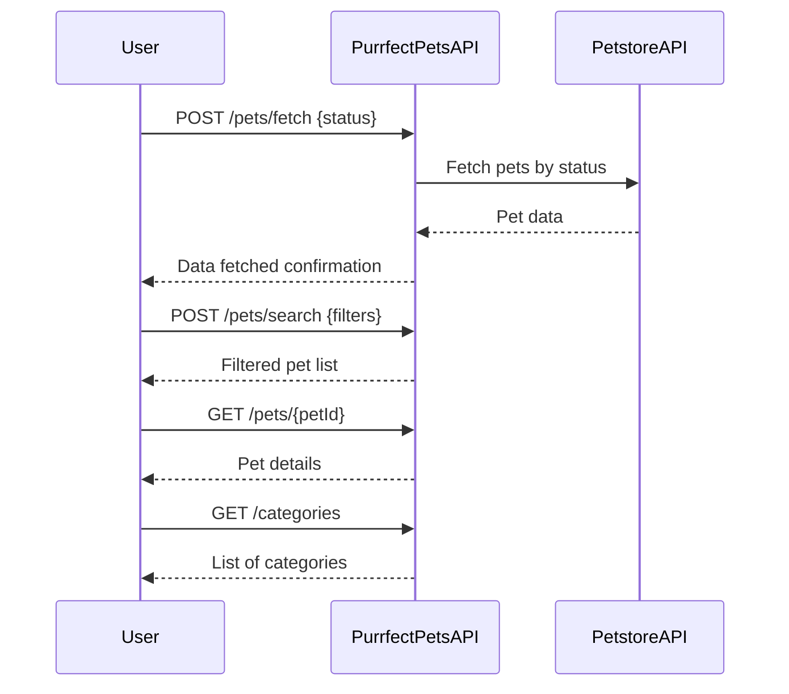

# Purrfect Pets API - Functional Requirements & API Endpoints

## Functional Requirements & API Endpoints

### 1. Add Petstore Data (POST /pets/fetch)
- **Description:** Fetches pet data from the external Petstore API and stores or updates it in the application for local querying.
- **Request:**
  ```json
  {
    "sourceUrl": "https://petstore.swagger.io/v2/pet/findByStatus",
    "status": "available"
  }
  ```
- **Response:**
  ```json
  {
    "message": "Data fetched and stored successfully",
    "count": 25
  }
  ```
- **Notes:** This POST endpoint triggers data retrieval and processing from the external source, adhering to Cyoda’s event-driven workflow.

---

### 2. Search Pets (POST /pets/search)
- **Description:** Search pets by filters like category, status, name, or tags.
- **Request:**
  ```json
  {
    "category": "Cats",
    "status": "available",
    "name": "Fluffy",
    "tags": ["friendly","small"]
  }
  ```
- **Response:**
  ```json
  [
    {
      "id": 101,
      "name": "Fluffy",
      "category": "Cats",
      "status": "available",
      "tags": ["friendly", "small"]
    }
  ]
  ```
- **Notes:** Business logic and filtering are handled here; no direct external calls.

---

### 3. Get Pet Details (GET /pets/{petId})
- **Description:** Retrieve pet details by pet ID from local storage.
- **Response:**
  ```json
  {
    "id": 101,
    "name": "Fluffy",
    "category": "Cats",
    "status": "available",
    "tags": ["friendly", "small"],
    "photoUrls": ["http://example.com/photos/101.jpg"]
  }
  ```

---

### 4. Get All Categories (GET /categories)
- **Description:** Retrieve all pet categories available in the system.
- **Response:**
  ```json
  [
    "Dogs",
    "Cats",
    "Birds",
    "Reptiles"
  ]
  ```

---

# User-App Interaction Sequence Diagram



---

# User Journey Diagram

```mermaid
flowchart TD
    A[User wants pet data] --> B[Request to fetch pet data (POST /pets/fetch)]
    B --> C{Data stored locally?}
    C -- Yes --> D[Search pets (POST /pets/search)]
    C -- No --> B
    D --> E[View pet details (GET /pets/{petId})]
    E --> F[Browse categories (GET /categories)]
```