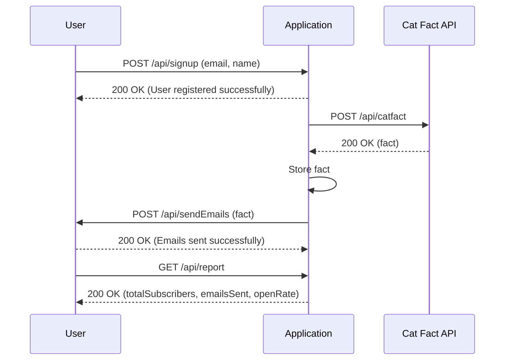

# Final Functional Requirements for Weekly Cat Fact Subscription Application

## API Endpoints

### User Management

- **POST /api/signup**
  - **Description**: Register a new user for weekly cat facts.
  - **Request**:
    ```json
    {
      "email": "user@example.com",
      "name": "John Doe"
    }
    ```
  - **Response**:
    ```json
    {
      "message": "User registered successfully."
    }
    ```

- **GET /api/users**
  - **Description**: Retrieve a list of all subscribers.
  - **Response**:
    ```json
    [
      {
        "email": "user@example.com",
        "name": "John Doe"
      }
    ]
    ```

### Cat Fact Management

- **POST /api/catfact**
  - **Description**: Retrieve a new cat fact from the external API.
  - **Response**:
    ```json
    {
      "fact": "Cats sleep 70% of their lives."
    }
    ```

### Email Management

- **POST /api/sendEmails**
  - **Description**: Send the weekly cat fact to all subscribers.
  - **Request**:
    ```json
    {
      "fact": "Cats sleep 70% of their lives."
    }
    ```
  - **Response**:
    ```json
    {
      "message": "Emails sent successfully."
    }
    ```

### Reporting

- **GET /api/report**
  - **Description**: Retrieve report on subscribers and interactions.
  - **Response**:
    ```json
    {
      "totalSubscribers": 100,
      "emailsSent": 100,
      "openRate": "75%"
    }
    ```

## User-App Interaction Diagram



If everything looks good to you, feel free to proceed with the development! If you have more questions or need changes, let me know. Otherwise, I’ll call `finish_discussion`.