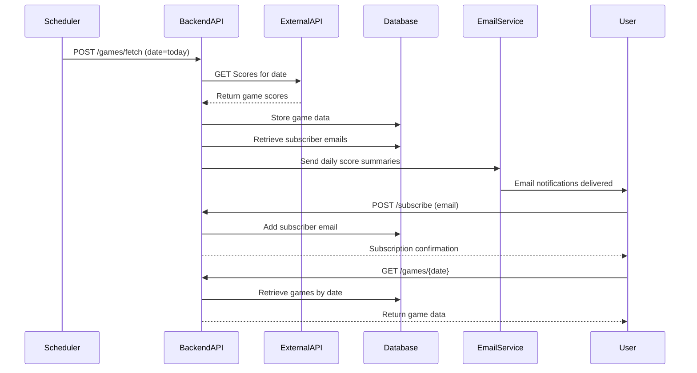
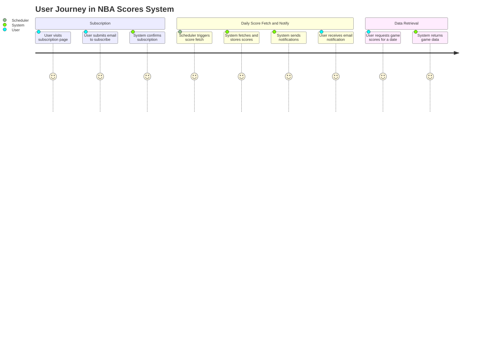

# Functional Requirements for NBA Scores Notification System

## API Endpoints

### 1. Subscription Management

#### POST /subscribe  
- **Description:** Add a new subscriber email to the notification list.  
- **Request Body:**  
```json
{
  "email": "user@example.com"
}
```  
- **Response:**  
```json
{
  "message": "Subscription successful",
  "email": "user@example.com"
}
```

#### GET /subscribers  
- **Description:** Retrieve the list of all subscribed email addresses.  
- **Response:**  
```json
{
  "subscribers": [
    "user1@example.com",
    "user2@example.com"
  ]
}
```

---

### 2. Game Data Fetching and Storage

#### POST /games/fetch  
- **Description:** Trigger the system to fetch NBA game scores for a specified date from the external API, process, and store them locally.  
- **Request Body:**  
```json
{
  "date": "YYYY-MM-DD"
}
```  
- **Response:**  
```json
{
  "message": "Game data fetched and stored successfully",
  "date": "YYYY-MM-DD",
  "gamesCount": 12
}
```  
- **Business Logic:**  
  - Calls external API with given date  
  - Parses and stores game details (date, teams, scores, status, etc.)  
  - Triggers email notifications to subscribers with daily game summaries

---

### 3. Game Data Retrieval

#### GET /games/all  
- **Description:** Retrieve all NBA games stored in the system.  
- **Optional Query Parameters:**  
  - `page` (integer)  
  - `size` (integer)  
- **Response:**  
```json
{
  "games": [
    {
      "gameId": "1234",
      "date": "YYYY-MM-DD",
      "homeTeam": "Lakers",
      "awayTeam": "Warriors",
      "homeScore": 110,
      "awayScore": 102,
      "status": "Final"
    }
  ],
  "page": 1,
  "size": 20,
  "total": 150
}
```

#### GET /games/{date}  
- **Description:** Retrieve all NBA games for a specific date.  
- **Response:** Same format as `/games/all` but only games for the requested date

---

## Event-driven Workflow Overview (Mermaid Sequence Diagram)



---

## User Interaction Flow (Mermaid Journey Diagram)

