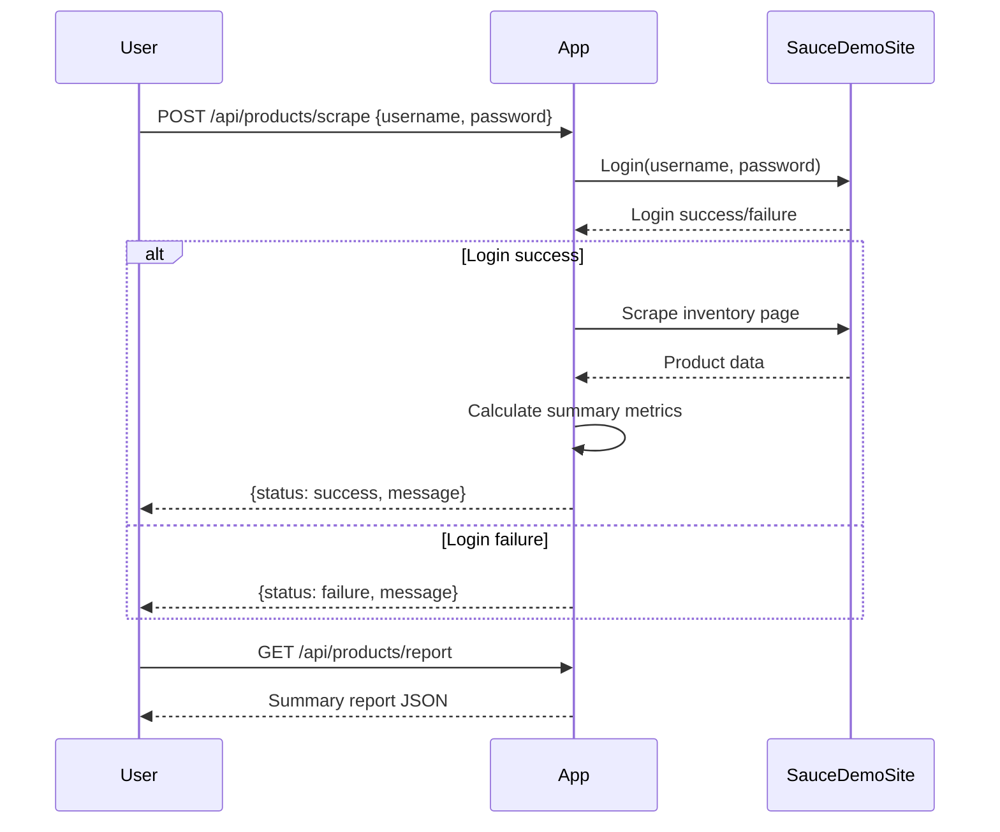
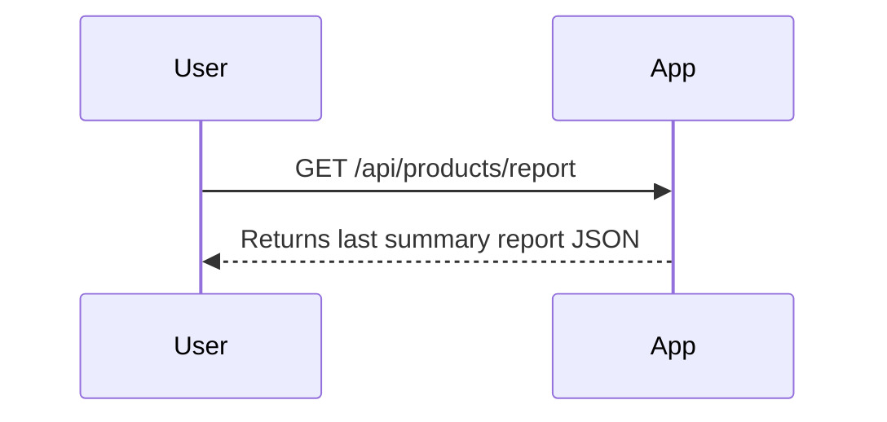

```markdown
# Functional Requirements

## API Endpoints

### 1. POST /api/products/scrape
- **Purpose:** Trigger web scraping of the SauceDemo inventory page, retrieve product data, and calculate summary metrics.
- **Request Body:**  
  ```json
  {
    "username": "string",    // SauceDemo login username
    "password": "string"     // SauceDemo login password
  }
  ```
- **Response Body:**  
  ```json
  {
    "status": "success | failure",
    "message": "string describing outcome"
  }
  ```
- **Notes:**  
  - This endpoint performs login, scrapes item name, description, price, and assumes inventory quantity = 1 per item.
  - Calculates total products, average price, highest and lowest priced items, total inventory value.
  - Stores the summary report internally for retrieval.

### 2. GET /api/products/report
- **Purpose:** Retrieve the last generated summary report.
- **Response Body:**  
  ```json
  {
    "totalProducts": 10,
    "averagePrice": 29.99,
    "highestPricedItem": {
      "name": "Item A",
      "price": 49.99
    },
    "lowestPricedItem": {
      "name": "Item B",
      "price": 9.99
    },
    "totalInventoryValue": 299.90
  }
  ```

---

## Business Logic Flow

- User calls **POST /api/products/scrape** with credentials.
- Application logs into SauceDemo, scrapes product data.
- Calculates summary metrics.
- Stores report internally.
- User calls **GET /api/products/report** to retrieve the summary.

---

## User-App Interaction Sequence Diagram



---

## Summary Report Retrieval Flow


```