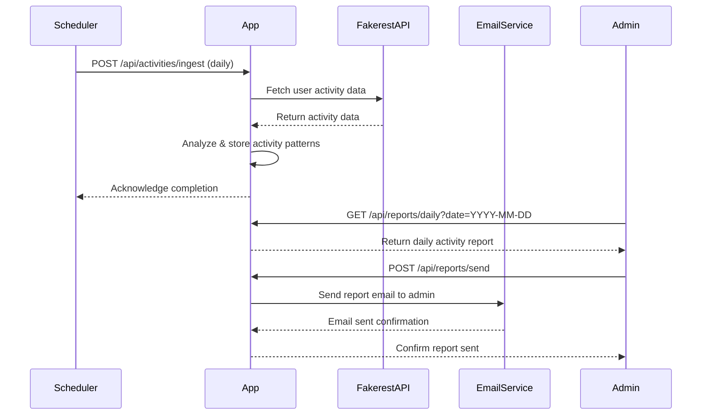
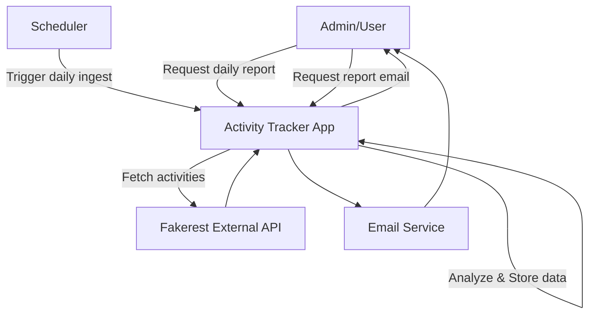

```markdown
# Activity Tracker Application - Functional Requirements

## API Endpoints

### 1. POST /api/activities/ingest  
**Description:** Trigger ingestion of user activity data from Fakerest API, process and analyze it.  
**Request:**  
```json
{
  "date": "YYYY-MM-DD"  // Optional, defaults to current date if omitted
}
```  
**Response:**  
```json
{
  "status": "success",
  "message": "Activity data ingested and analyzed for the date YYYY-MM-DD"
}
```

---

### 2. GET /api/reports/daily  
**Description:** Retrieve the generated daily report (summary of user activities).  
**Query Parameters:**  
- `date` (optional, defaults to current date)  
**Response:**  
```json
{
  "date": "YYYY-MM-DD",
  "summary": {
    "totalUsers": 100,
    "totalActivities": 450,
    "patterns": {
      "mostFrequentActivity": "Running",
      "averageActivityPerUser": 4.5
    },
    "anomalies": [
      "User 23 had zero activities",
      "Spike in 'Swimming' activity at 15:00"
    ]
  }
}
```

---

### 3. POST /api/reports/send  
**Description:** Send the daily report to admin email.  
**Request:**  
```json
{
  "date": "YYYY-MM-DD"  // Optional, defaults to current date if omitted
}
```  
**Response:**  
```json
{
  "status": "success",
  "message": "Daily report sent to admin email for the date YYYY-MM-DD"
}
```

---

## Business Logic Notes  
- The ingestion endpoint fetches user activity data from the Fakerest API, processes it to identify patterns (activity frequency, types), and stores results.  
- The reports endpoint retrieves stored summarized data.  
- Sending report endpoint triggers sending email with the report.  
- Daily ingestion is scheduled via internal scheduler triggering the POST `/api/activities/ingest` automatically.  

---

## User-App Interaction Sequence



---

## User Journey Diagram


```