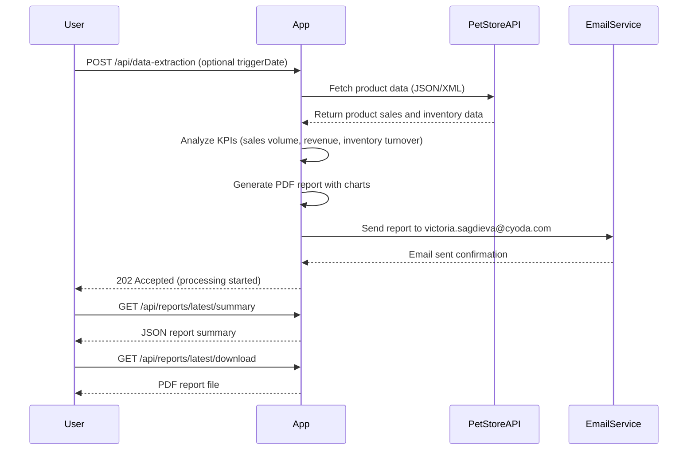

```markdown
# Functional Requirements and API Specification for Product Performance Analysis and Reporting System

## Functional Requirements Summary

- The system fetches all product data from the Pet Store API every Monday.
- Analysis includes KPIs: sales volume, revenue, and inventory turnover.
- Reports cover data from the past week only.
- Weekly summary reports are generated as PDF attachments including visual charts.
- Reports are emailed automatically to a fixed recipient list (victoria.sagdieva@cyoda.com).
- Underperforming products are highlighted automatically based on predefined thresholds.
- A fixed report template is used initially.
- Email body includes a brief overview of the report.
- Retrieval of report summaries and downloadable reports via GET endpoints.
- Data extraction, KPI calculations, and report generation triggered via POST endpoint.

---

## API Endpoints

### 1. Trigger Data Extraction & Analysis  
**POST** `/api/data-extraction`  
- Description: Initiates data fetch from Pet Store API, performs KPI calculations, generates report, and emails it.  
- Request Body:  
```json
{
  "triggerDate": "2024-06-03"  // Optional: date of data extraction (defaults to current date)
}
```  
- Response:  
```json
{
  "status": "started",
  "message": "Data extraction and report generation initiated."
}
```

---

### 2. Retrieve Latest Report Summary  
**GET** `/api/reports/latest/summary`  
- Description: Returns summary data of the latest generated report (KPIs and highlights).  
- Response:  
```json
{
  "reportDate": "2024-06-03",
  "salesVolume": 1234,
  "revenue": 56789.00,
  "inventoryTurnover": 4.5,
  "underperformingProducts": [
    {"productId": "p123", "reason": "Low sales volume"},
    {"productId": "p456", "reason": "High inventory"}
  ]
}
```

---

### 3. Download Latest Report PDF  
**GET** `/api/reports/latest/download`  
- Description: Downloads the latest weekly report PDF.  
- Response:  
- Content-Type: `application/pdf`  
- Response Body: Binary PDF file stream

---

## User-App Interaction Sequence


```