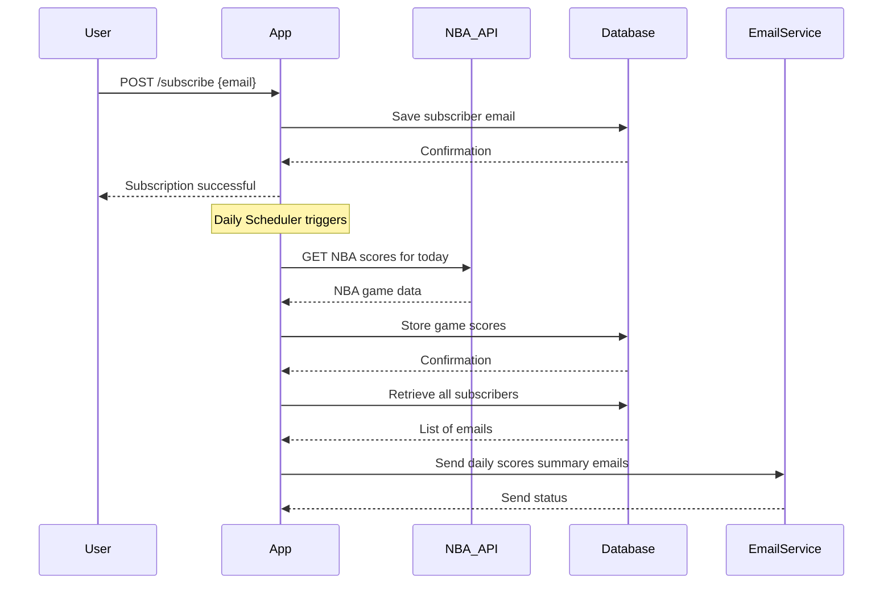

# Functional Requirements and API Design

## API Endpoints

### 1. Subscribe to Notifications  
**POST /subscribe**  
- **Description**: User subscribes with email to receive daily NBA scores.  
- **Request Body**:  
```json
{
  "email": "user@example.com"
}
```  
- **Response**:  
```json
{
  "message": "Subscription successful"
}
```  
- **Business Logic**:  
  - Validate email format.  
  - Ignore duplicate subscriptions silently.  
  - Store new subscriber.

---

### 2. Fetch and Store NBA Scores  
**POST /scores/fetch**  
- **Description**: Manually trigger fetching today's NBA scores from external API, store them locally, and send notifications.  
- **Request Body**:  
```json
{
  "date": "YYYY-MM-DD"
}
```  
- **Response**:  
```json
{
  "message": "Scores fetched, stored, and notifications sent"
}
```  
- **Business Logic**:  
  - Call external NBA API asynchronously.  
  - Parse and save game data.  
  - Send email notifications to subscribers.

---

### 3. List Subscribers  
**GET /subscribers**  
- **Description**: Retrieve a list of all subscriber emails.  
- **Response**:  
```json
[
  "user1@example.com",
  "user2@example.com"
]
```

---

### 4. Get All Games  
**GET /games/all**  
- **Description**: Retrieve all stored NBA games, supports optional pagination/filtering.  
- **Query Parameters** (optional):  
  - `page` (int)  
  - `size` (int)  
- **Response**:  
```json
[
  {
    "date": "2025-03-25",
    "homeTeam": "Lakers",
    "awayTeam": "Celtics",
    "homeScore": 102,
    "awayScore": 99,
    "status": "Final"
  },
  ...
]
```

---

### 5. Get Games by Date  
**GET /games/{date}**  
- **Description**: Retrieve all games for a specific date (YYYY-MM-DD).  
- **Response**: Same as `/games/all` but filtered by date.

---

# Mermaid Sequence Diagram: User Subscription and Notification Flow



---

# Mermaid Flowchart: Application Workflow

```mermaid
flowchart TD
    A[Scheduler triggers daily fetch] --> B[POST /scores/fetch]
    B --> C[Call external NBA API]
    C --> D[Store fetched scores in DB]
    D --> E[Fetch subscribers from DB]
    E --> F[Send notification emails]
    F --> G[Process complete]

    subgraph User Interaction
        U1[POST /subscribe] --> U2[Store subscriber]
        U3[GET /subscribers]
        U4[GET /games/all]
        U5[GET /games/{date}]
    end
```