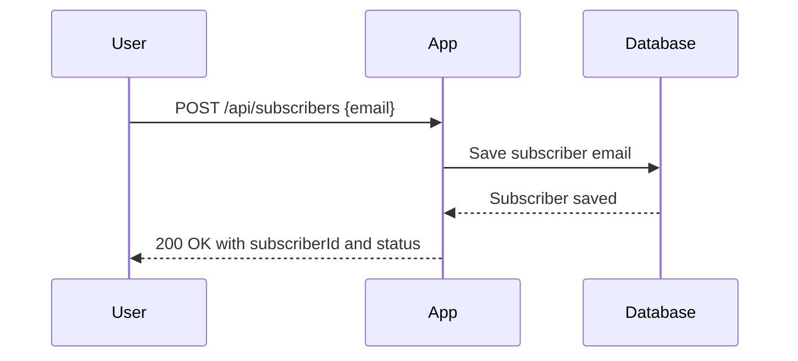
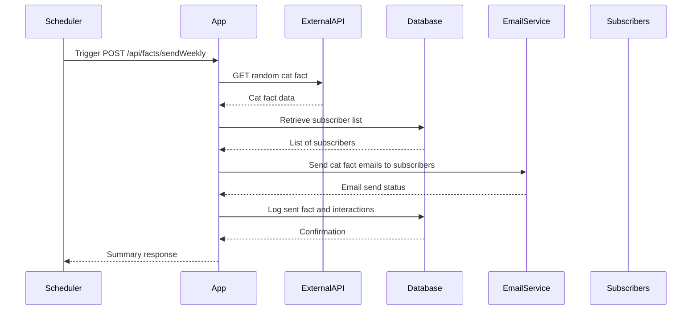
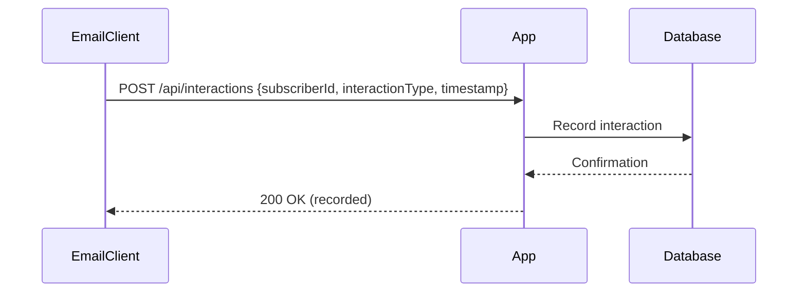
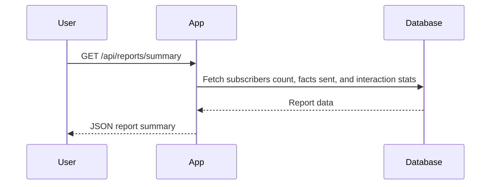

```markdown
# Functional Requirements and API Design for Weekly Cat Fact Subscription App

## API Endpoints

### 1. User Sign-up
- **Endpoint:** `POST /api/subscribers`
- **Description:** Register a new subscriber with their email.
- **Request:**
  ```json
  {
    "email": "user@example.com"
  }
  ```
- **Response:**
  ```json
  {
    "subscriberId": "uuid",
    "email": "user@example.com",
    "status": "subscribed"
  }
  ```

### 2. Trigger Weekly Cat Fact Retrieval & Email Send
- **Endpoint:** `POST /api/facts/sendWeekly`
- **Description:** Fetch a new cat fact from the external API, send it to all subscribers, and record interactions.
- **Request:** No body required.
- **Response:**
  ```json
  {
    "sentCount": 123,
    "catFact": "Cats have five toes on their front paws, but only four on the back.",
    "timestamp": "2024-06-01T10:00:00Z"
  }
  ```

### 3. Get Subscriber List
- **Endpoint:** `GET /api/subscribers`
- **Description:** Retrieve a list of all subscribers.
- **Response:**
  ```json
  [
    {
      "subscriberId": "uuid",
      "email": "user@example.com",
      "status": "subscribed"
    },
    ...
  ]
  ```

### 4. Get Reporting Summary
- **Endpoint:** `GET /api/reports/summary`
- **Description:** Get summary statistics like total subscribers, total cat facts sent, and email interaction counts.
- **Response:**
  ```json
  {
    "totalSubscribers": 150,
    "totalFactsSent": 52,
    "totalEmailOpens": 120,
    "totalEmailClicks": 75,
    "lastFactSentAt": "2024-05-25T10:00:00Z"
  }
  ```

### 5. Track Email Interactions (Opens and Clicks)
- **Endpoint:** `POST /api/interactions`
- **Description:** Track when a subscriber opens an email or clicks a link inside the email.
- **Request:**
  ```json
  {
    "subscriberId": "uuid",
    "interactionType": "open" | "click",
    "timestamp": "2024-06-01T12:00:00Z"
  }
  ```
- **Response:**
  ```json
  {
    "status": "recorded",
    "subscriberId": "uuid",
    "interactionType": "open",
    "timestamp": "2024-06-01T12:00:00Z"
  }
  ```

---

## Mermaid Diagrams

### User Sign-up & Subscription Flow



### Weekly Fact Retrieval and Email Sending Flow



### Interaction Tracking Flow



### Reporting Retrieval Flow


```

If you have no further questions or requests, I will now finish the discussion.