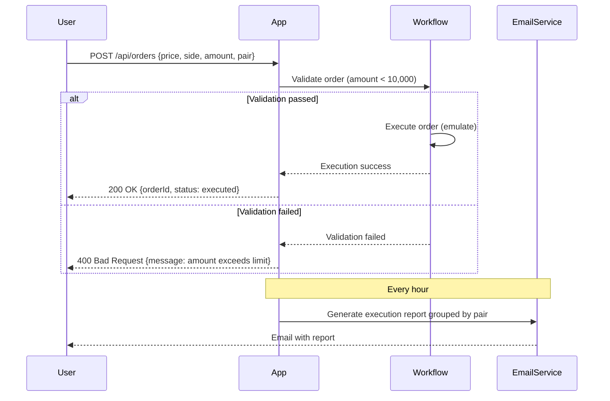

```markdown
# Functional Requirements for Order Processing Demo App

## Overview
The application generates and processes orders with fields: price, side, amount, and pair. Each order undergoes a workflow consisting of validation and execution. Additionally, an hourly email report summarizes total executed amounts grouped by trading pair.

---

## API Endpoints

### 1. Create Order  
- **URL:** `/api/orders`  
- **Method:** POST  
- **Description:** Accepts an order creation request, validates the order, and executes it if valid.  
- **Request Body:**  
```json
{
  "price": 123.45,
  "side": "buy",          // Allowed values: "buy" or "sell"
  "amount": 1000,
  "pair": "BTC/USD"
}
```  
- **Response:**  
```json
{
  "orderId": "uuid",
  "status": "executed" | "rejected",
  "message": "Validation passed and executed" | "Amount exceeds limit"
}
```

### 2. Get Order Status  
- **URL:** `/api/orders/{orderId}`  
- **Method:** GET  
- **Description:** Retrieves details and current status of an order by its ID.  
- **Response:**  
```json
{
  "orderId": "uuid",
  "price": 123.45,
  "side": "buy",
  "amount": 1000,
  "pair": "BTC/USD",
  "status": "executed" | "rejected" | "pending",
  "createdAt": "ISO8601 timestamp"
}
```

### 3. Get Execution Report  
- **URL:** `/api/reports/executions`  
- **Method:** GET  
- **Description:** Returns the latest aggregated execution report showing total executed amounts grouped by pair.  
- **Response:**  
```json
{
  "reportGeneratedAt": "ISO8601 timestamp",
  "executions": [
    {
      "pair": "BTC/USD",
      "totalAmount": 15000
    },
    {
      "pair": "ETH/USD",
      "totalAmount": 5000
    }
  ]
}
```

---

## Order Workflow

1. **Validation:**  
   - Check that `amount < 10,000`.  
   - Orders failing validation are rejected and not executed.

2. **Execution:**  
   - Emulate real execution by marking the order as executed immediately after validation passes.

---

## Reporting

- Every hour, an email is sent to a configured address containing a summary report of total executed amounts grouped by trading pair.

---

## User-App Interaction Sequence


```