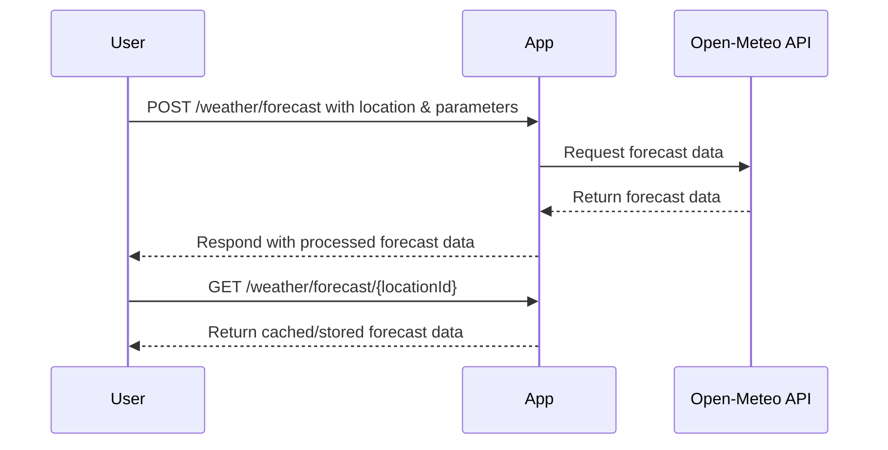

# Functional Requirements for Weather Data Fetching App

## API Endpoints

### 1. POST /weather/forecast
- **Purpose:** Fetch weather forecast data from the external API based on input parameters.
- **Request Body (JSON):**
  ```json
  {
    "latitude": 52.52,
    "longitude": 13.405,
    "parameters": ["temperature_2m", "precipitation"],
    "start_date": "2024-06-01",
    "end_date": "2024-06-02"
  }
  ```
- **Response (JSON):**
  ```json
  {
    "status": "success",
    "data": {
      "latitude": 52.52,
      "longitude": 13.405,
      "forecast": [
        {
          "date": "2024-06-01",
          "temperature_2m": 20.5,
          "precipitation": 0.0
        },
        {
          "date": "2024-06-02",
          "temperature_2m": 21.1,
          "precipitation": 0.2
        }
      ]
    }
  }
  ```
- **Business Logic:** This endpoint calls the external Open-Meteo API with the provided parameters, processes the response, and returns structured forecast data.

---

### 2. GET /weather/forecast/{locationId}
- **Purpose:** Retrieve the latest stored weather forecast result for a given location identifier.
- **Response (JSON):**
  ```json
  {
    "locationId": "1234",
    "forecast": [
      {
        "date": "2024-06-01",
        "temperature_2m": 20.5,
        "precipitation": 0.0
      },
      {
        "date": "2024-06-02",
        "temperature_2m": 21.1,
        "precipitation": 0.2
      }
    ]
  }
  ```

---

## User-App Interaction Sequence Diagram

