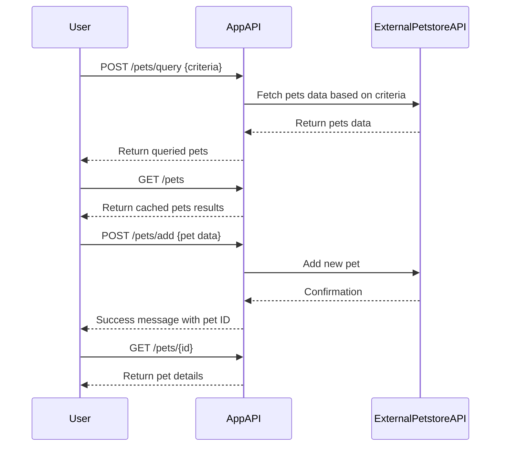

```markdown
# Functional Requirements for "Purrfect Pets" API

## API Endpoints

### 1. POST /pets/query
- **Description:** Query pets by criteria (type, status, name, etc.). Handles external data fetching and business logic.
- **Request:**
  ```json
  {
    "type": "string (optional)",
    "status": "string (optional)",
    "name": "string (optional)"
  }
  ```
- **Response:**
  ```json
  {
    "pets": [
      {
        "id": "integer",
        "name": "string",
        "type": "string",
        "status": "string",
        "photoUrls": ["string"]
      }
    ]
  }
  ```

### 2. GET /pets
- **Description:** Retrieve the latest queried pets results stored in the application.
- **Response:**
  ```json
  {
    "pets": [
      {
        "id": "integer",
        "name": "string",
        "type": "string",
        "status": "string",
        "photoUrls": ["string"]
      }
    ]
  }
  ```

### 3. POST /pets/add
- **Description:** Add a new pet to the system; may invoke business logic or external API.
- **Request:**
  ```json
  {
    "name": "string",
    "type": "string",
    "status": "string",
    "photoUrls": ["string"]
  }
  ```
- **Response:**
  ```json
  {
    "id": "integer",
    "message": "Pet added successfully"
  }
  ```

### 4. GET /pets/{id}
- **Description:** Retrieve details of a single pet by ID from stored results.
- **Response:**
  ```json
  {
    "id": "integer",
    "name": "string",
    "type": "string",
    "status": "string",
    "photoUrls": ["string"]
  }
  ```

---

## User-App Interaction Sequence Diagram


```