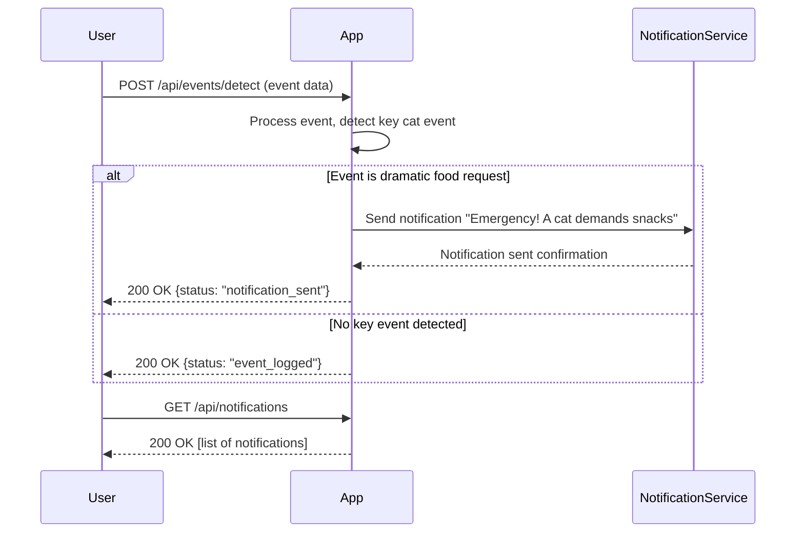

# Functional Requirements and API Design for Cat Event Detection App

## API Endpoints

### 1. POST /api/events/detect  
**Description:** Receive and process cat event data (e.g., food request detection). This endpoint handles incoming event data, applies business logic, and triggers notifications if necessary.  
**Request:**  
```json
{
  "eventType": "string",          // e.g., "dramatic_food_request"
  "eventData": {                  // additional event-specific data
    "intensity": "high",          // optional, e.g., intensity of the request
    "timestamp": "ISO8601 string"
  }
}
```
**Response:**  
```json
{
  "status": "string",             // e.g., "notification_sent" or "event_logged"
  "message": "string"             // additional info
}
```

---

### 2. GET /api/notifications  
**Description:** Retrieve a list of recent notifications sent by the system.  
**Response:**  
```json
[
  {
    "id": "uuid",
    "message": "Emergency! A cat demands snacks",
    "eventType": "dramatic_food_request",
    "timestamp": "ISO8601 string"
  }
]
```

---

### 3. POST /api/notifications/manual  
**Description:** Manually send a notification (for testing or override).  
**Request:**  
```json
{
  "message": "string"             // notification message
}
```
**Response:**  
```json
{
  "status": "string",             // e.g., "sent"
  "message": "string"
}
```

---

## User-App Interaction Sequence Diagram



---

This document captures the key functional requirements and API design for your cat event detection app.  
Feel free to reach out if you want to expand or adjust anything!