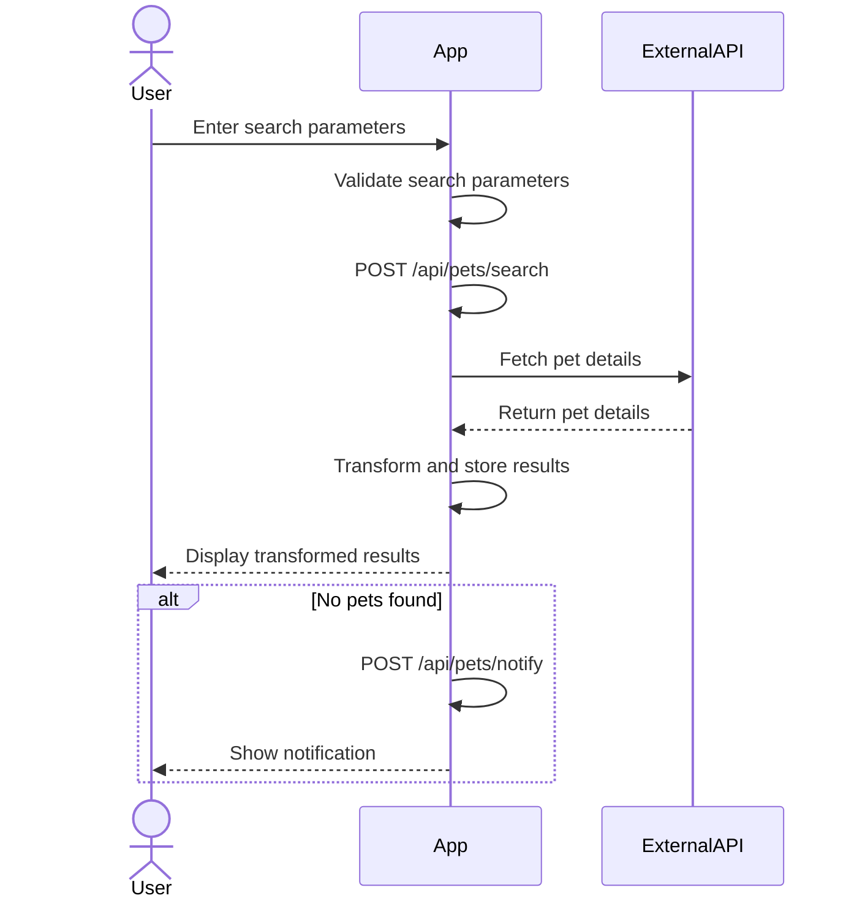

# Final Functional Requirements for Pet Details Application

## API Endpoints

### 1. POST /api/pets/search
- **Description:** Fetch pet details based on search parameters.
- **Request Format:**
  ```json
  {
    "species": "string",
    "status": "string",
    "categoryId": "string"
  }
  ```
- **Response Format:**
  ```json
  {
    "pets": [
      {
        "Name": "string",
        "Species": "string",
        "Status": "string",
        "Category": "string",
        "AvailabilityStatus": "string"
      }
    ]
  }
  ```

### 2. GET /api/pets/results
- **Description:** Retrieve the transformed and stored search results.
- **Response Format:**
  ```json
  {
    "pets": [
      {
        "Name": "string",
        "Species": "string",
        "Status": "string",
        "Category": "string",
        "AvailabilityStatus": "string"
      }
    ]
  }
  ```

### 3. POST /api/pets/notify
- **Description:** Notify users if no pets match the search criteria.
- **Request Format:**
  ```json
  {
    "message": "No pets found matching your criteria."
  }
  ```
- **Response Format:**
  ```json
  {
    "status": "success",
    "notificationSent": true
  }
  ```

## Visual Representation of User-App Interaction



```mermaid
journey
    title User Interaction with Pet Details Application

    section Search Pets
      User: Enter search parameters: 5: Active
      App: Validate search parameters: 5: Active
      App: Fetch and transform data: 5: Active
    end

    section Results
      App: Display results: 5: Active
      User: View transformed pet details: 5: Active
      App: Send notification if no results: 5: Active
    end
```