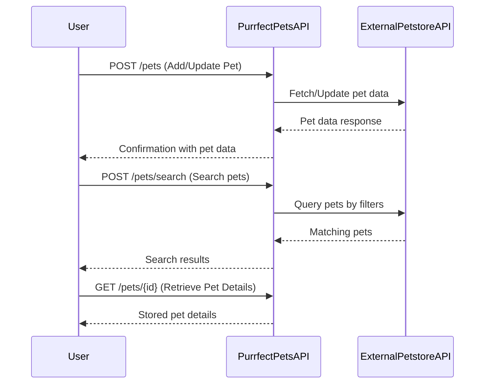

```markdown
# Functional Requirements for Purrfect Pets API

## API Endpoints

### 1. Add or Update Pets (POST /pets)
- **Purpose:** Add new pets or update existing pets, fetching and manipulating external Petstore API data.
- **Request:**
```json
{
  "id": "optional, for update",
  "name": "string",
  "category": "string",
  "status": "string",
  "details": {
    "age": "integer",
    "breed": "string",
    "description": "string"
  }
}
```
- **Response:**
```json
{
  "success": true,
  "pet": {
    "id": "string",
    "name": "string",
    "category": "string",
    "status": "string",
    "details": { ... }
  }
}
```

### 2. Search or Filter Pets (POST /pets/search)
- **Purpose:** Search for pets by category, status, or other attributes, using external API data.
- **Request:**
```json
{
  "category": "optional string",
  "status": "optional string",
  "name": "optional string"
}
```
- **Response:**
```json
{
  "results": [
    {
      "id": "string",
      "name": "string",
      "category": "string",
      "status": "string",
      "details": { ... }
    }
  ]
}
```

### 3. Retrieve Pet Details (GET /pets/{id})
- **Purpose:** Retrieve stored pet details from the application database.
- **Response:**
```json
{
  "id": "string",
  "name": "string",
  "category": "string",
  "status": "string",
  "details": { ... }
}
```

---

## User-App Interaction Sequence



---

## Summary

- POST /pets: Add or update pet data, invoking external Petstore API.
- POST /pets/search: Search pets by filters using external API.
- GET /pets/{id}: Retrieve stored pet details.
- POST endpoints handle business logic and external data interaction.
- GET endpoints only retrieve app-stored results.
```
