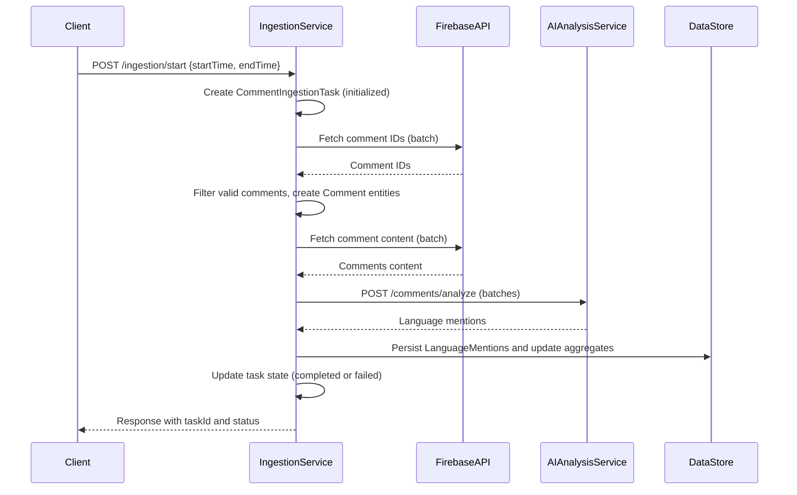
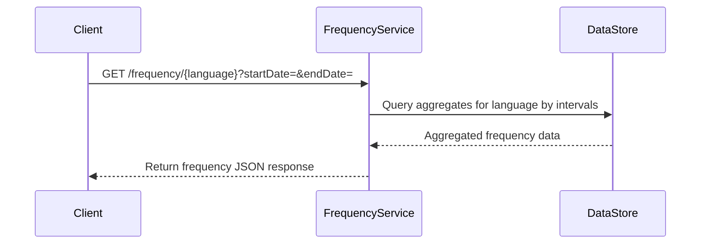
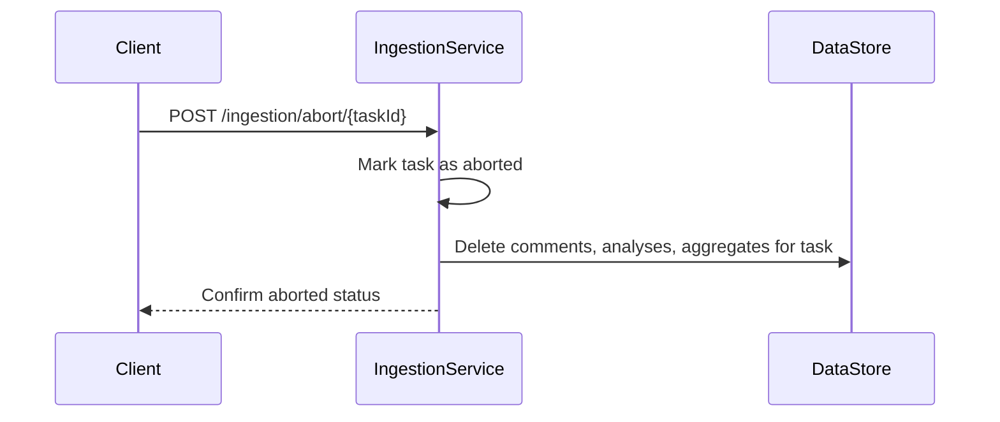

# Functional Requirements and API Specification

## API Endpoints

### 1. Start Ingestion Task  
**POST /ingestion/start**

Starts a new ingestion task for a specified time range.

**Request Body:**
```json
{
  "startTime": "2023-06-01T00:00:00Z",
  "endTime": "2025-06-01T00:00:00Z"
}
```

**Response:**
```json
{
  "taskId": "task-20250612-abc123",
  "status": "initialized"
}
```

---

### 2. Get Ingestion Task Status  
**GET /ingestion/status/{taskId}**

Retrieves the current status and progress of an ingestion task.

**Response:**
```json
{
  "taskId": "task-20250612-abc123",
  "status": "fetching_comments",
  "progress": {
    "commentsFetched": 25000,
    "commentsTotalEstimate": 100000
  }
}
```

---

### 3. Abort Ingestion Task  
**POST /ingestion/abort/{taskId}**

Aborts an ongoing ingestion task and triggers immediate cleanup.

**Response:**
```json
{
  "taskId": "task-20250612-abc123",
  "status": "aborted"
}
```

---

### 4. Query Language Mention Frequency  
**GET /frequency/{language}**

Retrieves mention frequency counts for a programming language aggregated by daily, weekly, and monthly intervals over an optional date range.

**Query Parameters (optional):**
- `startDate` (ISO 8601 string, e.g. `2023-01-01`)
- `endDate` (ISO 8601 string, e.g. `2023-07-01`)

**Response:**
```json
{
  "language": "Python",
  "frequency": {
    "daily": [ { "period": "2023-07-01", "count": 12 } ],
    "weekly": [ { "period": "2023-W27", "count": 56 } ],
    "monthly": [ { "period": "2023-07", "count": 145 } ]
  }
}
```

---

### 5. Analyze Comments Batch  
**POST /comments/analyze**

Internal endpoint to submit a batch of comments for AI-powered language mention extraction.

**Request Body:**
```json
{
  "comments": [
    {
      "commentId": "12345",
      "text": "I prefer Python and Rust for this project."
    }
  ]
}
```

**Response:**
```json
{
  "results": [
    {
      "commentId": "12345",
      "languagesMentioned": ["Python", "Rust"]
    }
  ]
}
```

---

## Configuration and Behavior

- Batch size for comment analysis is configurable only via application properties at startup.
- The language list is static and loaded at service startup.
- Aggregation intervals are fixed: daily, weekly, monthly.
- Aggregation API supports querying arbitrary date ranges for these intervals.
- Multiple ingestion tasks can run concurrently, limited by a semaphore.
- Aborting a task triggers immediate synchronous cleanup of associated data.
- Partial failures in AI analysis cause only failed comments to be retried; others proceed.

---

## Mermaid Sequence Diagrams

### Ingestion Task Workflow



---

### Frequency Query



---

### Abort Ingestion Task


