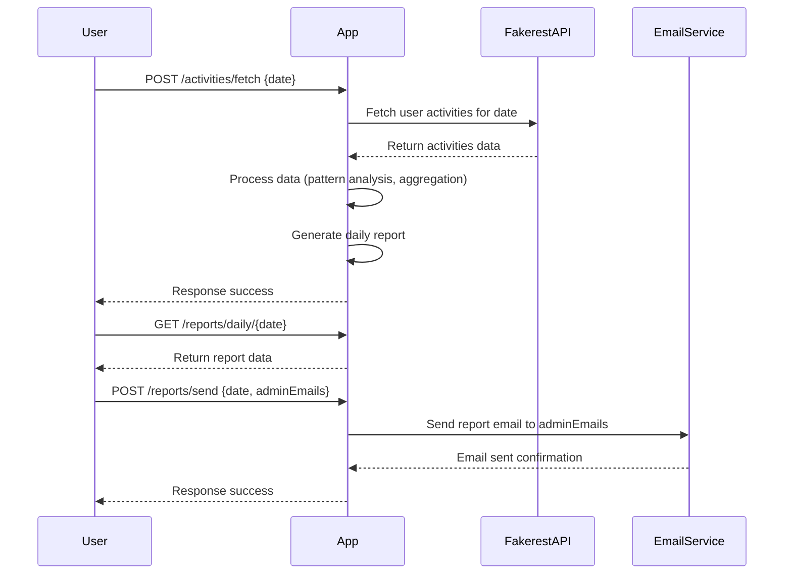

# Activity Tracker Application - Functional Requirements

## API Endpoints

### 1. POST /activities/fetch  
**Description:**  
Trigger the ingestion of user activity data from the Fakerest API, process it to identify patterns, and generate daily reports.  
**Request:**  
```json
{
  "date": "YYYY-MM-DD"
}
```  
- `date`: The date for which activities should be fetched and processed (usually today or a specific day).  

**Response:**  
```json
{
  "status": "success",
  "message": "Activities fetched, processed, and report generated for 2024-06-01"
}
```  

---

### 2. GET /reports/daily/{date}  
**Description:**  
Retrieve the generated daily activity report for a specific date.  
**Request:**  
- Path parameter: `date` in format `YYYY-MM-DD`  

**Response:**  
```json
{
  "date": "2024-06-01",
  "reports": [
    {
      "userId": 1,
      "activitySummary": {
        "totalActivities": 10,
        "activityTypes": {
          "running": 4,
          "cycling": 3,
          "swimming": 3
        },
        "anomalies": [
          "Unusually high running frequency"
        ]
      }
    },
    {
      "userId": 2,
      "activitySummary": {
        "totalActivities": 5,
        "activityTypes": {
          "walking": 5
        },
        "anomalies": []
      }
    }
  ]
}
```

---

### 3. POST /reports/send  
**Description:**  
Send the generated daily report via email to the admin(s).  
**Request:**  
```json
{
  "date": "YYYY-MM-DD",
  "adminEmails": ["admin@example.com"]
}
```  
- `date`: The report date to send.  
- `adminEmails`: List of email addresses to receive the report.  

**Response:**  
```json
{
  "status": "success",
  "message": "Report for 2024-06-01 sent to admin@example.com"
}
```

---

## Business Logic Flow Summary  
- POST `/activities/fetch` triggers data ingestion from Fakerest API, processing, and report generation.  
- GET `/reports/daily/{date}` retrieves stored processed reports.  
- POST `/reports/send` emails reports to admin(s).

---

## User-App Interaction Sequence Diagram

