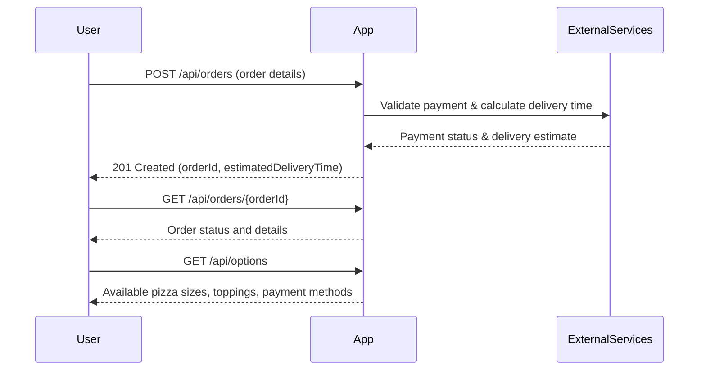

# Pizza Ordering Workflow - Functional Requirements and API Design

## Functional Requirements

1. **Create Order**  
   User submits pizza order details (size, toppings, delivery address, payment info).  
   Business logic validates input, calculates price, interacts with external services if needed (e.g., payment gateway, delivery estimation), and creates an order.

2. **Get Order Status**  
   Retrieve current status and details of an existing order by order ID.

3. **List Available Options**  
   Retrieve predefined pizza sizes, toppings, and payment methods.

---

## API Endpoints

### 1. Create Order

- **POST** `/api/orders`

**Request:**

```json
{
  "customerId": "string",
  "pizza": {
    "size": "small|medium|large",
    "toppings": ["string"]
  },
  "delivery": {
    "address": "string",
    "scheduledTime": "ISO8601 string (optional)"
  },
  "payment": {
    "method": "credit_card|paypal|cash",
    "details": {
      // card number, expiry etc. depending on method
    }
  }
}
```

**Response:**

```json
{
  "orderId": "string",
  "status": "created",
  "estimatedDeliveryTime": "ISO8601 string"
}
```

---

### 2. Get Order Status

- **GET** `/api/orders/{orderId}`

**Response:**

```json
{
  "orderId": "string",
  "status": "created|preparing|baking|out_for_delivery|delivered|cancelled",
  "pizza": {
    "size": "small|medium|large",
    "toppings": ["string"]
  },
  "delivery": {
    "address": "string",
    "estimatedDeliveryTime": "ISO8601 string"
  }
}
```

---

### 3. List Available Options

- **GET** `/api/options`

**Response:**

```json
{
  "sizes": ["small", "medium", "large"],
  "toppings": ["pepperoni", "mushrooms", "onions", "sausage", "bacon"],
  "paymentMethods": ["credit_card", "paypal", "cash"]
}
```

---

## User-App Interaction Sequence Diagram

