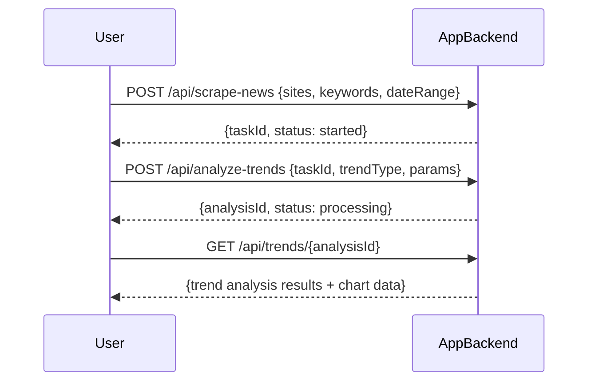

```markdown
# Functional Requirements and API Design

## API Endpoints

### 1. POST /api/scrape-news
- **Description**: Trigger scraping of financial news from configured sites.
- **Request Body**:
```json
{
  "sites": ["site1.com", "site2.com"],      // Optional: list of sites to scrape; if empty or omitted, use default sites
  "keywords": ["stocks", "market"],          // Optional: keywords to filter news
  "dateRange": {                             // Optional: filter news by date range
    "from": "2024-01-01",
    "to": "2024-01-31"
  }
}
```
- **Response**:
```json
{
  "taskId": "string",                        // Unique id to track scraping task
  "status": "started"
}
```

### 2. POST /api/analyze-trends
- **Description**: Analyze scraped news data to generate trends.
- **Request Body**:
```json
{
  "taskId": "string",                        // taskId from scraping step or existing dataset id
  "trendType": "sentiment" | "keywordFrequency" | "custom",  // Type of trend analysis
  "params": {                               // Optional parameters depending on trendType
    "keywords": ["inflation", "bonds"]
  }
}
```
- **Response**:
```json
{
  "analysisId": "string",                    // Id of the created analysis
  "status": "processing"
}
```

### 3. GET /api/trends/{analysisId}
- **Description**: Retrieve trend analysis results and chart data.
- **Response**:
```json
{
  "analysisId": "string",
  "trendType": "sentiment",
  "results": {
    "timeSeries": [
      {"date": "2024-01-01", "value": 0.7},
      {"date": "2024-01-02", "value": 0.65}
    ],
    "chartData": {
      "type": "line",
      "labels": ["2024-01-01", "2024-01-02"],
      "datasets": [
        {
          "label": "Sentiment score",
          "data": [0.7, 0.65]
        }
      ]
    }
  }
}
```

---

## User-App Interaction (Sequence Diagram)



---

## Summary

- POST endpoints handle external data fetching and processing.
- GET endpoint retrieves processed results.
- Data filtering and trend analysis parameters allow flexibility.
- Chart data returned in JSON format for frontend rendering.
```
