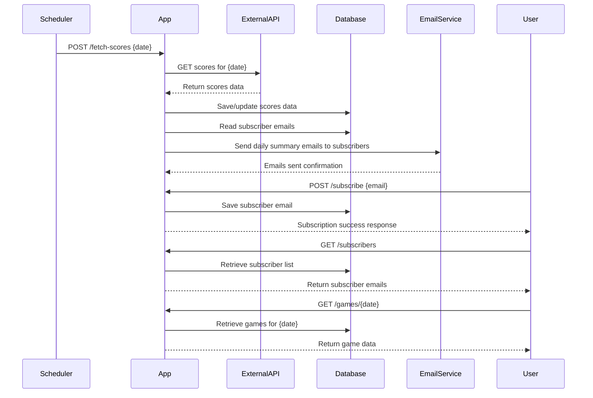

# Functional Requirements and API Design

## API Endpoints

### 1. **POST /fetch-scores**  
- **Description:** Trigger fetching NBA scores for a specific date from the external API, process and store them, then send notifications to subscribers.  
- **Request Body:**
```json
{
  "date": "YYYY-MM-DD"
}
```  
- **Response:**
```json
{
  "status": "success",
  "message": "Scores fetched, stored, and notifications sent."
}
```  
- **Notes:** This endpoint handles external API calls and downstream processing. Scheduled job will call this internally. The system overwrites existing game data for the same date.

---

### 2. **POST /subscribe**  
- **Description:** Add a new subscriber email to the notification list.  
- **Request Body:**
```json
{
  "email": "user@example.com"
}
```  
- **Response:**
```json
{
  "status": "success",
  "message": "Email subscribed successfully."
}
```  

---

### 3. **GET /subscribers**  
- **Description:** Retrieve the list of all subscribed emails.  
- **Response:**
```json
[
  "user1@example.com",
  "user2@example.com"
]
```

---

### 4. **GET /games/all**  
- **Description:** Retrieve all stored NBA games data, optionally filtered by pagination parameters (e.g., page, size).  
- **Query Parameters (optional):** `page`, `size`  
- **Response:**
```json
[
  {
    "date": "YYYY-MM-DD",
    "homeTeam": "Team A",
    "awayTeam": "Team B",
    "homeScore": 100,
    "awayScore": 98,
    "additionalInfo": "..."
  }
]
```

---

### 5. **GET /games/{date}**  
- **Description:** Retrieve all NBA games for a specific date.  
- **Path Parameter:** `date` (format: YYYY-MM-DD)  
- **Response:**
```json
[
  {
    "date": "YYYY-MM-DD",
    "homeTeam": "Team A",
    "awayTeam": "Team B",
    "homeScore": 100,
    "awayScore": 98,
    "additionalInfo": "..."
  }
]
```

---

## Notification Email Format  
- Plain text summary of all games played on the specified day.

---

# User-App Interaction Sequence Diagram

