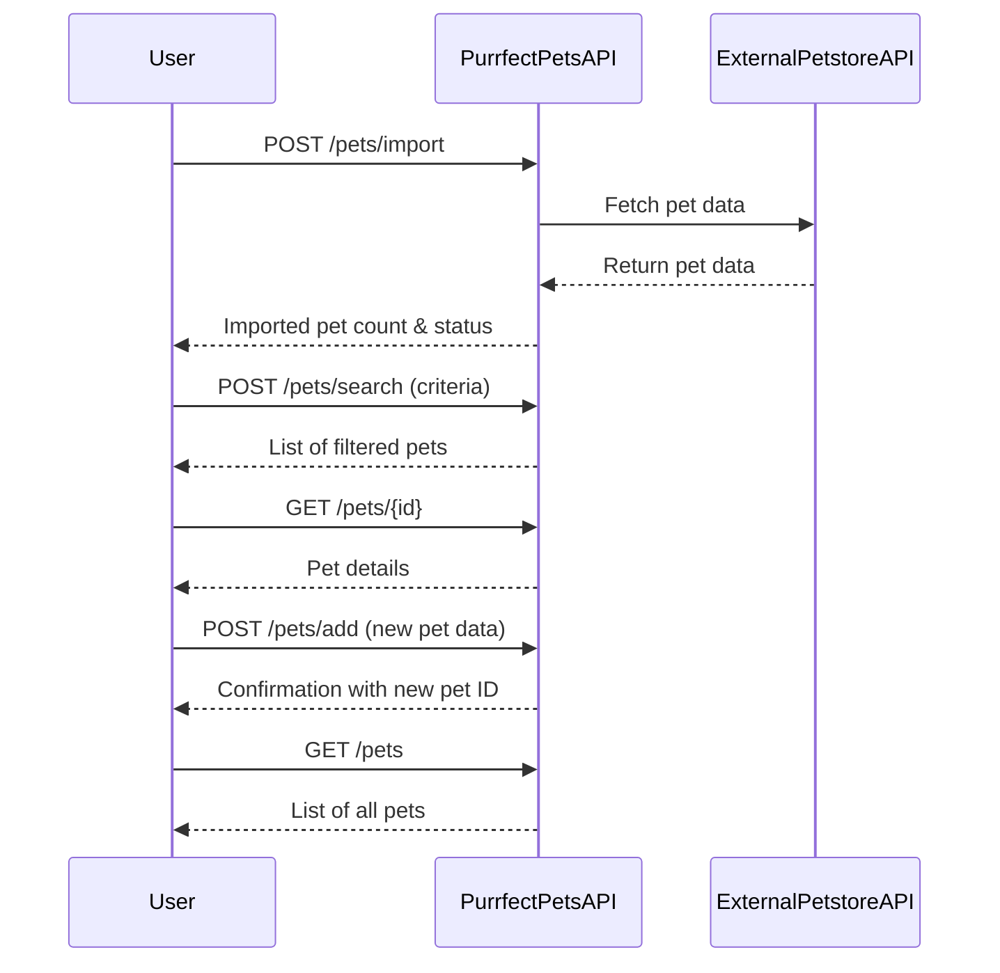

# Purrfect Pets API - Functional Requirements

## API Endpoints

### 1. POST /pets/import  
**Description:** Import or refresh pet data from the external Petstore API.  
**Request:**  
```json
{
  "sourceUrl": "string"  // Optional URL of the external Petstore API (defaults to known source)
}
```  
**Response:**  
```json
{
  "importedCount": 42,
  "status": "success"
}
```  
**Business Logic:** Calls external Petstore API, imports or updates internal pet data.

---

### 2. POST /pets/search  
**Description:** Search pets with filter criteria (e.g., type, status, name).  
**Request:**  
```json
{
  "type": "string (optional)",
  "status": "string (optional)",
  "name": "string (optional)"
}
```  
**Response:**  
```json
[
  {
    "id": 1,
    "name": "Fluffy",
    "type": "Cat",
    "status": "available",
    "tags": ["cute", "small"]
  }
]
```  
**Business Logic:** Filters pet data based on criteria.

---

### 3. GET /pets/{id}  
**Description:** Retrieve pet details by pet ID.  
**Response:**  
```json
{
  "id": 1,
  "name": "Fluffy",
  "type": "Cat",
  "status": "available",
  "tags": ["cute", "small"]
}
```

---

### 4. POST /pets/add  
**Description:** Add a new pet to internal storage.  
**Request:**  
```json
{
  "name": "string",
  "type": "string",
  "status": "string",
  "tags": ["string"]
}
```  
**Response:**  
```json
{
  "id": 101,
  "message": "Pet added successfully"
}
```

---

### 5. GET /pets  
**Description:** Retrieve all pets in the system.  
**Response:**  
```json
[
  {
    "id": 1,
    "name": "Fluffy",
    "type": "Cat",
    "status": "available",
    "tags": ["cute", "small"]
  }
]
```

---

# Mermaid Sequence Diagram: User Interaction with Purrfect Pets API

