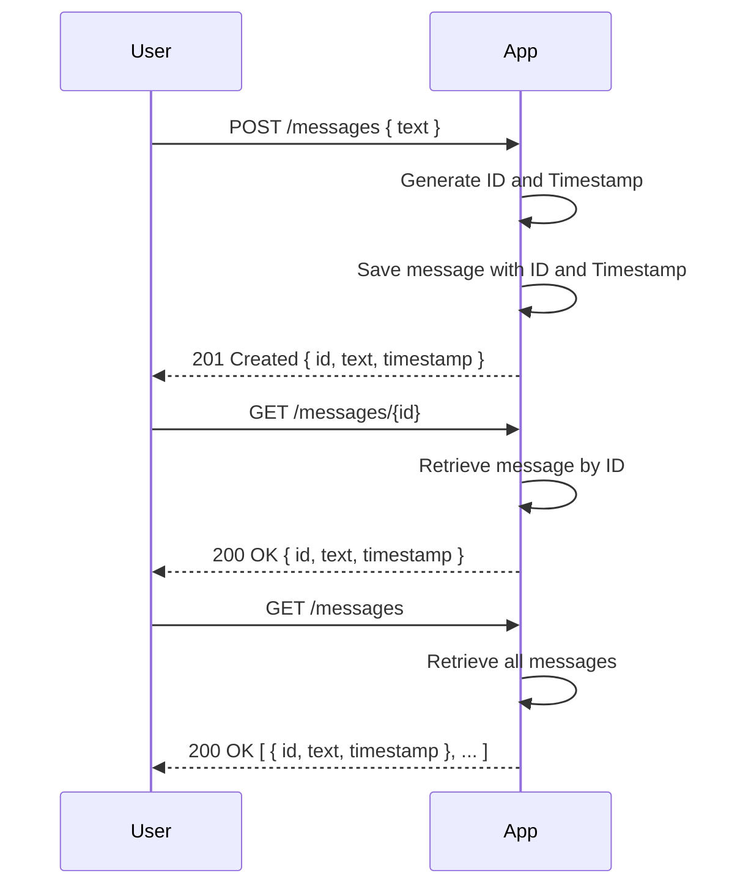
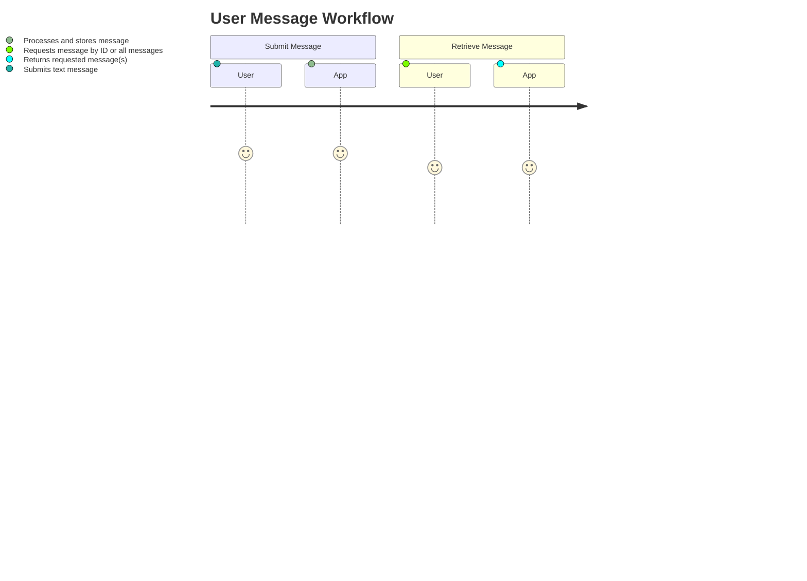

```markdown
# Functional Requirements and API Specification

## API Endpoints

### 1. Create Message (POST `/messages`)
- **Purpose**: Accept a user-provided text message, save it with a server-generated timestamp.
- **Request Body** (JSON):
  ```json
  {
    "text": "string"
  }
  ```
- **Response** (JSON):
  ```json
  {
    "id": "string",
    "text": "string",
    "timestamp": "ISO-8601 string"
  }
  ```

### 2. Get Message by ID (GET `/messages/{id}`)
- **Purpose**: Retrieve a stored message by its unique ID.
- **Response** (JSON):
  ```json
  {
    "id": "string",
    "text": "string",
    "timestamp": "ISO-8601 string"
  }
  ```

### 3. Get All Messages (GET `/messages`)
- **Purpose**: Retrieve all stored messages.
- **Response** (JSON array):
  ```json
  [
    {
      "id": "string",
      "text": "string",
      "timestamp": "ISO-8601 string"
    },
    ...
  ]
  ```

---

## Business Logic Notes
- All external data retrieval or calculations (if any in future) should be handled inside POST endpoints.
- GET endpoints only return already stored results.
- Server generates timestamps when saving messages.

---

## User-App Interaction (Sequence Diagram)



---

## User-App Interaction (Journey Diagram)


```