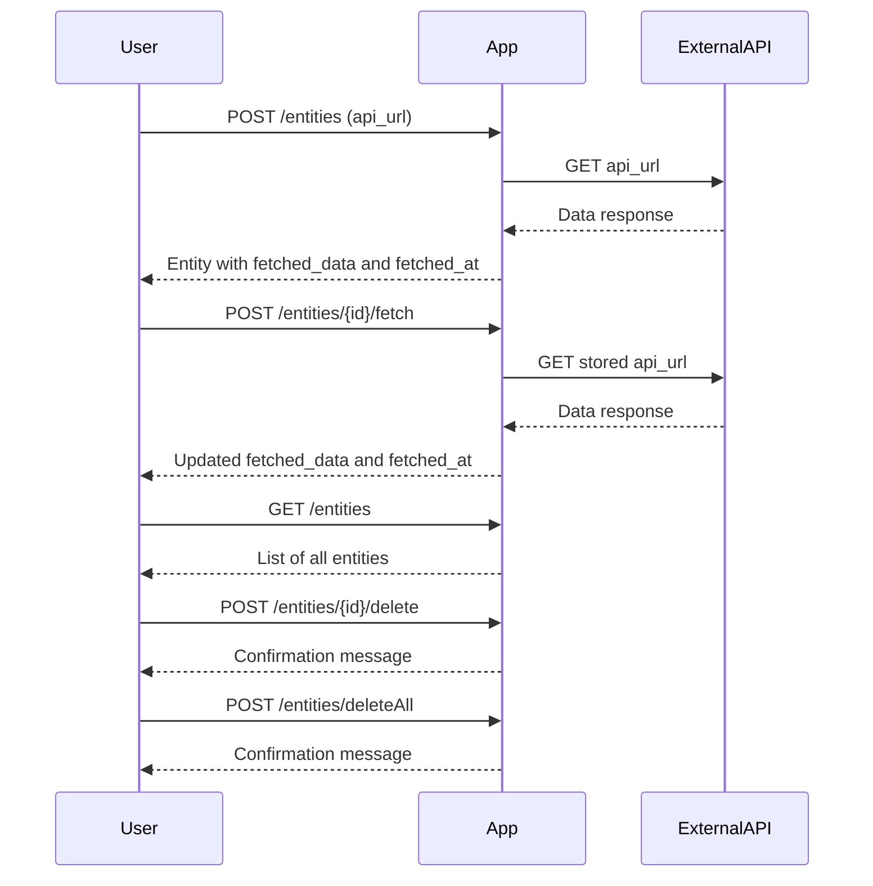

```markdown
# Functional Requirements and API Endpoints

## Entity Structure
- `id`: UUID (generated)
- `api_url`: JSON (JsonNode) — stores the external API URL provided by the user
- `fetched_data`: JSON (JsonNode) — stores the data fetched from the external API
- `fetched_at`: Timestamp — stores the datetime when data was last fetched

---

## API Endpoints

### 1. Create Entity & Fetch Data  
**POST** `/entities`  
**Request Body:**  
```json
{
  "api_url": { "url": "https://example.com/api" }
}
```  
**Response:**  
```json
{
  "id": "uuid",
  "api_url": {...},
  "fetched_data": {...},
  "fetched_at": "2024-06-01T12:00:00Z"
}
```  
**Behavior:** Creates the entity, triggers fetching data from the given API URL, and stores fetched data and timestamp.

---

### 2. Update Entity API URL & Fetch Data  
**POST** `/entities/{id}`  
**Request Body:**  
```json
{
  "api_url": { "url": "https://example.com/new-api" }
}
```  
**Response:**  
```json
{
  "id": "uuid",
  "api_url": {...},
  "fetched_data": {...},
  "fetched_at": "2024-06-01T12:30:00Z"
}
```  
**Behavior:** Updates the entity's API URL, triggers fetching new data, and updates fetched data and timestamp.

---

### 3. Manual Fetch Data for Entity  
**POST** `/entities/{id}/fetch`  
**Request Body:** *empty*  
**Response:**  
```json
{
  "id": "uuid",
  "fetched_data": {...},
  "fetched_at": "2024-06-01T13:00:00Z"
}
```  
**Behavior:** Triggers fetching data from the stored API URL for the entity and updates `fetched_data` and `fetched_at`.

---

### 4. Get All Entities  
**GET** `/entities`  
**Response:**  
```json
[
  {
    "id": "uuid",
    "api_url": {...},
    "fetched_data": {...},
    "fetched_at": "2024-06-01T13:00:00Z"
  },
  ...
]
```  
**Behavior:** Returns a list of all entities with their current stored data.

---

### 5. Delete Single Entity  
**POST** `/entities/{id}/delete`  
**Request Body:** *empty*  
**Response:**  
```json
{
  "message": "Entity deleted successfully."
}
```  
**Behavior:** Deletes the specified entity.

---

### 6. Delete All Entities  
**POST** `/entities/deleteAll`  
**Request Body:** *empty*  
**Response:**  
```json
{
  "message": "All entities deleted successfully."
}
```  
**Behavior:** Deletes all entities immediately.

---

# User-App Interaction Sequence Diagram


```