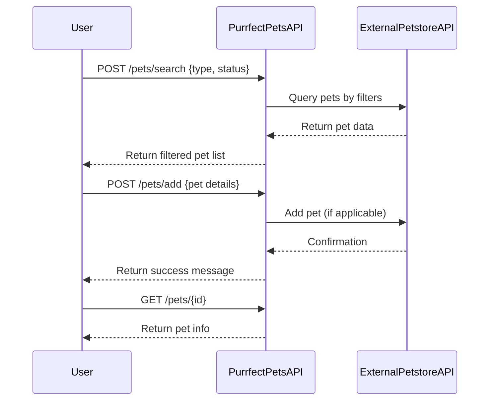
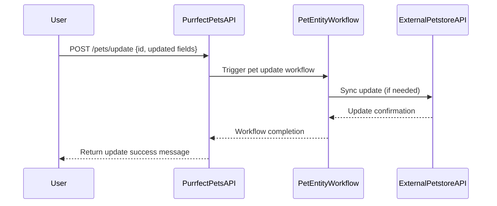

# Purrfect Pets API - Functional Requirements

## API Endpoints

### 1. POST /pets/search  
**Description:** Search pets by filters (type, status). Invokes external Petstore API, retrieves and processes data.  
**Request:**  
```json
{
  "type": "string",        // optional, e.g. "dog", "cat"
  "status": "string"       // optional, e.g. "available", "sold"
}
```  
**Response:**  
```json
[
  {
    "id": "long",
    "name": "string",
    "type": "string",
    "status": "string",
    "photoUrls": ["string"]
  }
]
```

---

### 2. POST /pets/add  
**Description:** Add new pet to the system; may invoke external API or internal workflow.  
**Request:**  
```json
{
  "name": "string",
  "type": "string",
  "status": "string",
  "photoUrls": ["string"]
}
```  
**Response:**  
```json
{
  "id": "long",
  "message": "Pet added successfully"
}
```

---

### 3. POST /pets/update  
**Description:** Update existing pet information.  
**Request:**  
```json
{
  "id": "long",
  "name": "string",       // optional
  "type": "string",       // optional
  "status": "string",     // optional
  "photoUrls": ["string"] // optional
}
```  
**Response:**  
```json
{
  "message": "Pet updated successfully"
}
```

---

### 4. POST /pets/delete  
**Description:** Remove a pet from the system by ID.  
**Request:**  
```json
{
  "id": "long"
}
```  
**Response:**  
```json
{
  "message": "Pet deleted successfully"
}
```

---

### 5. GET /pets/{id}  
**Description:** Retrieve pet information by ID (only local data retrieval, no external call).  
**Response:**  
```json
{
  "id": "long",
  "name": "string",
  "type": "string",
  "status": "string",
  "photoUrls": ["string"]
}
```

---

# User-App Interaction Sequence Diagram



---

# Pet Management Workflow Diagram



---