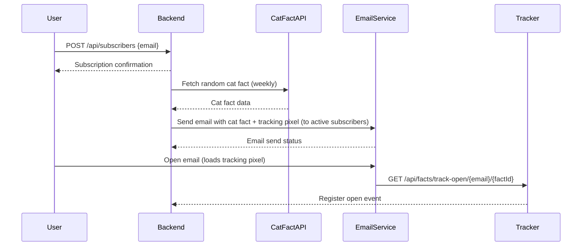
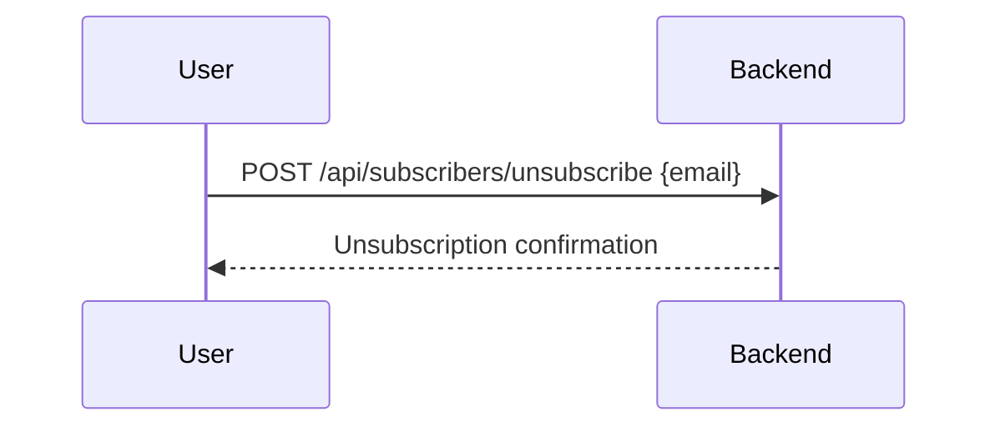
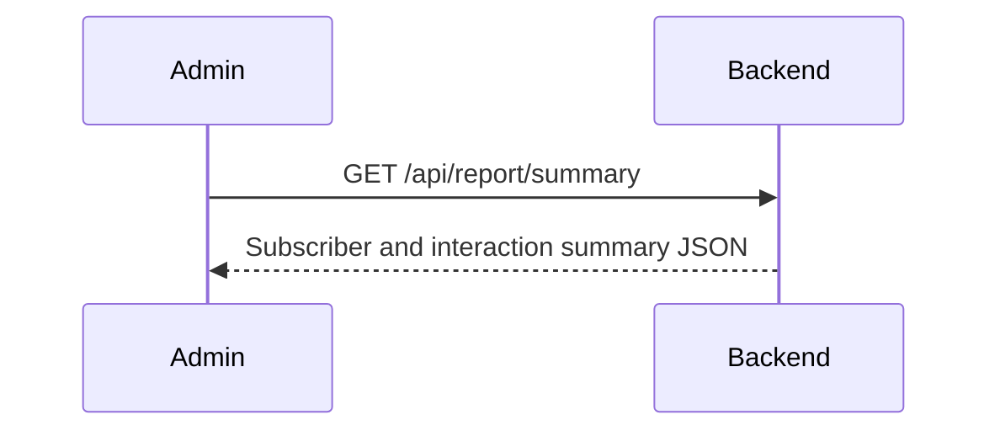

```markdown
# Functional Requirements and API Specification for Weekly Cat Fact Subscription

## Overview
A backend application that allows users to subscribe via email to receive a new cat fact every week. The system fetches cat facts from an external API on a scheduled basis and sends emails with embedded tracking pixels to monitor email opens. Users can unsubscribe via a link in the email. Reporting provides simple counts of subscribers and interactions accessible via an API.

---

## Functional Requirements

- **User Subscription:** Users subscribe by providing their email address (direct sign-up, no confirmation needed).
- **Unsubscribe:** Users can unsubscribe via a link included in every cat fact email.
- **Weekly Cat Fact Delivery:** The system fetches a new cat fact from the Cat Fact API once a week and sends it via email to all active subscribers.
- **Email Open Tracking:** Email opens are tracked using a tracking pixel embedded in the email.
- **Reporting:** Provide a simple count summary of total subscribers, active subscribers, emails sent, and email opens.
- **Failure Handling:** If the Cat Fact API is unavailable, skip sending that week's email.
- **Scheduling:** The fact fetching and email sending is triggered by a scheduled job within the application.

---

## API Endpoints

### 1. Subscribe User  
- **POST** `/api/subscribers`  
- **Request Body:**  
```json
{
  "email": "user@example.com"
}
```
- **Response:**  
```json
{
  "message": "Subscription successful"
}
```
- **Description:** Adds the email to the subscriber list.

---

### 2. Unsubscribe User  
- **POST** `/api/subscribers/unsubscribe`  
- **Request Body:**  
```json
{
  "email": "user@example.com"
}
```
- **Response:**  
```json
{
  "message": "Unsubscribed successfully"
}
```
- **Description:** Marks the user as unsubscribed.

---

### 3. Trigger Weekly Fact Fetch & Email Send  
- **POST** `/api/facts/send-weekly`  
- **Request Body:** `{}`  
- **Response:**  
```json
{
  "message": "Weekly cat fact sent to subscribers"
}
```
- **Description:** Fetches a new cat fact from the Cat Fact API and sends emails to all active subscribers. Scheduled internally but can be triggered manually.

---

### 4. Track Email Open  
- **GET** `/api/facts/track-open/{emailEncoded}/{factId}`  
- **Response:** Transparent 1x1 pixel image  
- **Description:** Embedded in emails to track opens, registers the event.

---

### 5. Reporting: Get Subscriber and Interaction Summary  
- **GET** `/api/report/summary`  
- **Response:**  
```json
{
  "totalSubscribers": 1234,
  "activeSubscribers": 1200,
  "emailsSentThisWeek": 1190,
  "emailOpensThisWeek": 850
}
```
- **Description:** Provides counts of subscribers and email interaction metrics.

---

## User-App Interaction Diagrams

### Subscription & Weekly Email Flow



---

### Unsubscribe Flow



---

### Reporting Retrieval


```
