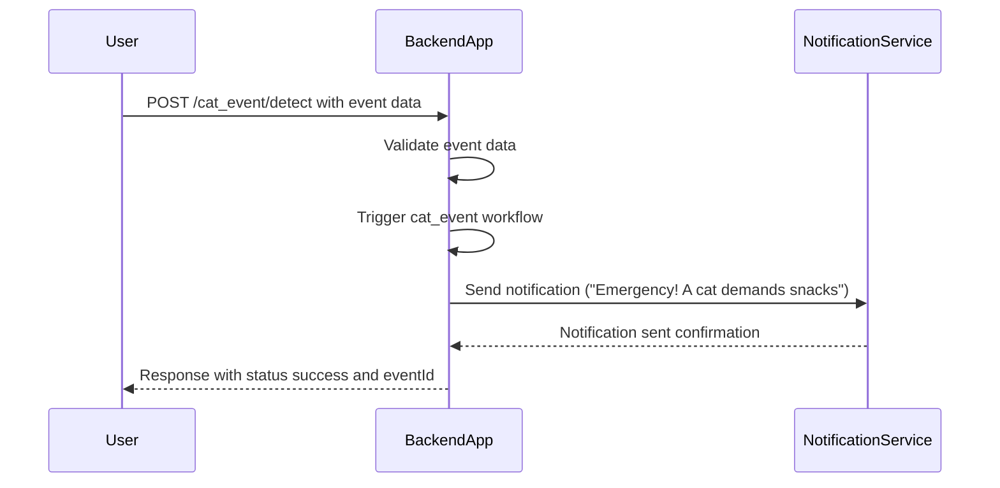
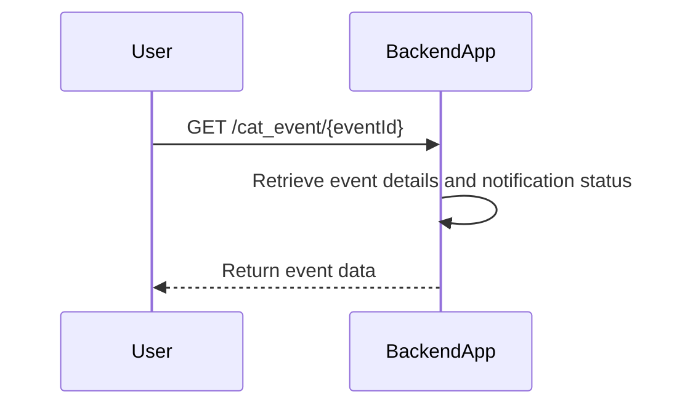

# Functional Requirements for Cat Event Detection App

## API Endpoints

### 1. POST /cat_event/detect  
**Description:** Receive cat event data (e.g., dramatic food request), process it, trigger workflow, and send notifications.  
**Request Body:**  
```json
{
  "eventType": "string",          // e.g., "food_request", "loud_meow"
  "eventDescription": "string",   // details about the event
  "timestamp": "ISO8601 string"   // event occurrence time
}
```  
**Response:**  
```json
{
  "status": "success",
  "message": "Notification sent",
  "eventId": "string"
}
```

---

### 2. GET /cat_event/{eventId}  
**Description:** Retrieve details and status of a specific cat event by ID.  
**Response:**  
```json
{
  "eventId": "string",
  "eventType": "string",
  "eventDescription": "string",
  "timestamp": "ISO8601 string",
  "notificationStatus": "string"  // e.g., "sent", "pending"
}
```

---

### 3. GET /cat_event  
**Description:** Retrieve a list of recent cat events with optional query parameters (e.g., limit, eventType).  
**Response:**  
```json
[
  {
    "eventId": "string",
    "eventType": "string",
    "eventDescription": "string",
    "timestamp": "ISO8601 string",
    "notificationStatus": "string"
  },
  ...
]
```

---

## Business Logic Notes  
- The POST `/cat_event/detect` endpoint processes incoming event data, triggers the Cyoda workflow for the `cat_event` entity, and sends notifications (e.g., email or push).  
- GET endpoints are read-only for retrieving stored event data and notification status.  
- Validation of event types and timestamps will be done in POST.  
- Notifications are sent instantly upon successful event detection.

---

## User-App Interaction Sequence Diagram



---

## Cat Event Retrieval Flow



---

Please let me know if you'd like to proceed to implementation or make any adjustments!