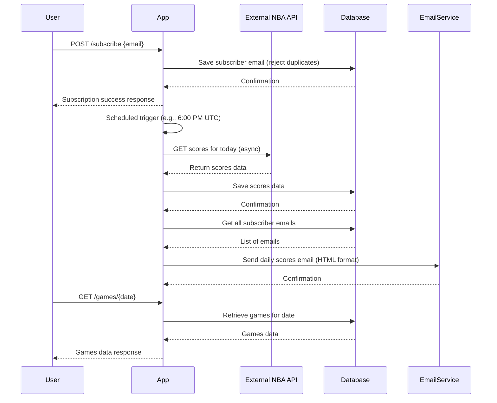

# Functional Requirements

## 1. Data Fetching and Storage
- The system must fetch NBA game score data daily at a scheduled time (e.g., 6:00 PM UTC).
- Data is fetched asynchronously from the external API endpoint:  
  `GET https://api.sportsdata.io/v3/nba/scores/json/ScoresBasicFinal/{today}?key=test`  
  where `{today}` is in `YYYY-MM-DD` format.
- The fetched data must be saved locally in the database including game details such as date, team names, scores, and other relevant information.

## 2. Subscription System
- Users can subscribe to daily notifications by providing their email via API.
- Duplicate subscriptions (same email) should be prevented.
- Subscribed users are stored in the system’s notification list.

## 3. Notification System
- After data fetching and storage, the system sends email notifications to all subscribers.
- Notifications include a summary of all games played on the fetched date.
- Email content will be formatted in HTML for better readability.

## 4. API Endpoints

| Method | Endpoint           | Description                                      | Request Body                     | Response                         |
|--------|--------------------|------------------------------------------------|---------------------------------|---------------------------------|
| POST   | `/fetch-scores`    | Fetch, save NBA scores, then send notifications | `{ "date": "YYYY-MM-DD" }` (optional) | `{ "status": "success", "message": "Scores fetched, saved, and notifications sent." }` |
| POST   | `/subscribe`       | Subscribe user email for daily notifications    | `{ "email": "user@example.com" }` | `{ "status": "success", "message": "Subscription added." }` |
| GET    | `/subscribers`     | Get list of all subscriber emails                | None                            | `{ "subscribers": ["email1", "email2", ...] }` |
| GET    | `/games/all`       | Retrieve all stored NBA games (optional pagination and filtering) | Query params: `page`, `size`, `team`, `dateFrom`, `dateTo` | `{ "games": [...], "pagination": {...} }` |
| GET    | `/games/{date}`    | Retrieve all NBA games for a specific date       | None                            | `{ "games": [...] }`             |

## 5. Scheduler
- A background scheduler triggers the `/fetch-scores` process daily at the specified time without manual API calls.

---

# User-App Interaction Sequence

---

If this matches your expectations, I’m ready to start the implementation!