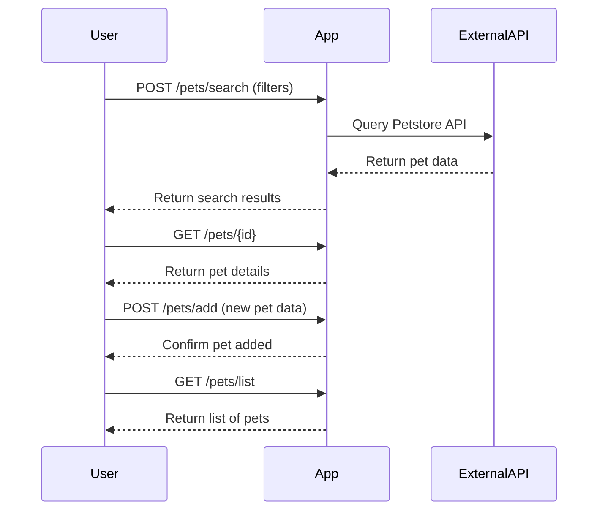

```markdown
# Functional Requirements for "Purrfect Pets" API

## API Endpoints

### 1. POST /pets/search
- **Description:** Search pets using filters; invokes external Petstore API to retrieve data.
- **Request Body:**
```json
{
  "status": "available | pending | sold",
  "category": "string",
  "name": "string"
}
```
- **Response:**
```json
{
  "pets": [
    {
      "id": "integer",
      "name": "string",
      "category": "string",
      "status": "available | pending | sold",
      "photoUrls": ["string"]
    }
  ]
}
```

### 2. GET /pets/{id}
- **Description:** Retrieve detailed info about a pet stored or cached internally.
- **Response:**
```json
{
  "id": "integer",
  "name": "string",
  "category": "string",
  "status": "available | pending | sold",
  "photoUrls": ["string"],
  "tags": ["string"]
}
```

### 3. POST /pets/add
- **Description:** Add a new pet entry to the internal store.
- **Request Body:**
```json
{
  "name": "string",
  "category": "string",
  "status": "available | pending | sold",
  "photoUrls": ["string"],
  "tags": ["string"]
}
```
- **Response:**
```json
{
  "message": "Pet added successfully",
  "id": "integer"
}
```

### 4. GET /pets/list
- **Description:** List all pets stored internally.
- **Response:**
```json
{
  "pets": [
    {
      "id": "integer",
      "name": "string",
      "category": "string",
      "status": "available | pending | sold"
    }
  ]
}
```

---

## User-App Interaction Sequence Diagram


```

I am calling finish_discussion now.