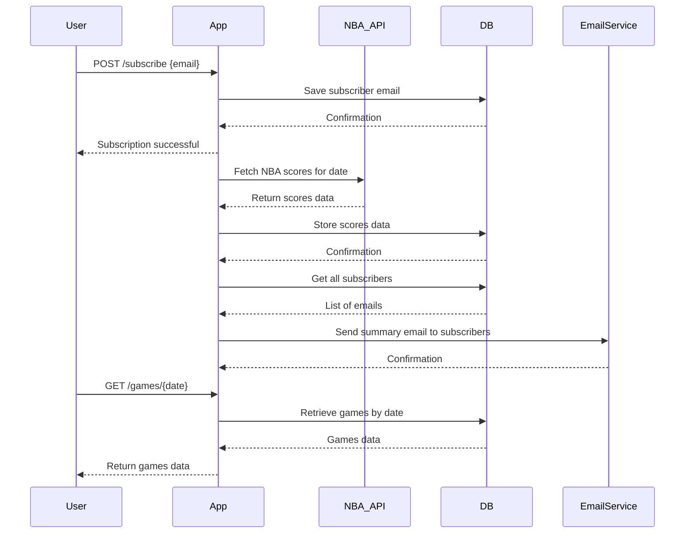

```markdown
# Functional Requirements and API Design

## API Endpoints

### 1. Subscribe User  
**POST /subscribe**  
- Description: Add a user email to the subscription list.  
- Request Body:  
```json
{
  "email": "user@example.com"
}
```  
- Response:  
```json
{
  "message": "Subscription successful",
  "email": "user@example.com"
}
```

### 2. Fetch and Store NBA Scores  
**POST /games/fetch**  
- Description: Trigger fetching NBA scores from the external API for a specific date and store them locally.  
- Request Body:  
```json
{
  "date": "YYYY-MM-DD"
}
```  
- Response:  
```json
{
  "message": "Scores fetched and stored successfully",
  "date": "YYYY-MM-DD",
  "gamesCount": 15
}
```

### 3. Send Notification Emails  
**POST /notifications/send**  
- Description: Trigger sending daily NBA scores notification emails to all subscribers for a specific date.  
- Request Body:  
```json
{
  "date": "YYYY-MM-DD"
}
```  
- Response:  
```json
{
  "message": "Notifications sent",
  "date": "YYYY-MM-DD",
  "emailsSent": 100
}
```

### 4. Retrieve All Subscribers  
**GET /subscribers**  
- Description: Retrieve a list of all subscribed email addresses.  
- Response:  
```json
[
  "user1@example.com",
  "user2@example.com",
  "user3@example.com"
]
```

### 5. Retrieve All Games  
**GET /games/all**  
- Description: Retrieve all stored NBA games, with optional pagination/filtering parameters.  
- Query Parameters (optional):  
  - `page` (int), `size` (int), `fromDate` (YYYY-MM-DD), `toDate` (YYYY-MM-DD)  
- Response:  
```json
[
  {
    "gameId": "1234",
    "date": "YYYY-MM-DD",
    "homeTeam": "Lakers",
    "awayTeam": "Warriors",
    "homeScore": 110,
    "awayScore": 105
  },
  ...
]
```

### 6. Retrieve Games by Date  
**GET /games/{date}**  
- Description: Retrieve all NBA games for a specific date.  
- Response:  
```json
[
  {
    "gameId": "1234",
    "date": "YYYY-MM-DD",
    "homeTeam": "Lakers",
    "awayTeam": "Warriors",
    "homeScore": 110,
    "awayScore": 105
  },
  ...
]
```

---

## User-App Interaction Sequence Diagram



---

## Summary

- POST endpoints perform external API calls or trigger processes (fetching data, sending notifications, subscribing users).  
- GET endpoints return stored data only (subscribers, games).  
- Email notifications are triggered via POST call or automated scheduler internally.  
- Data retrieval supports pagination and filtering where applicable.
```
