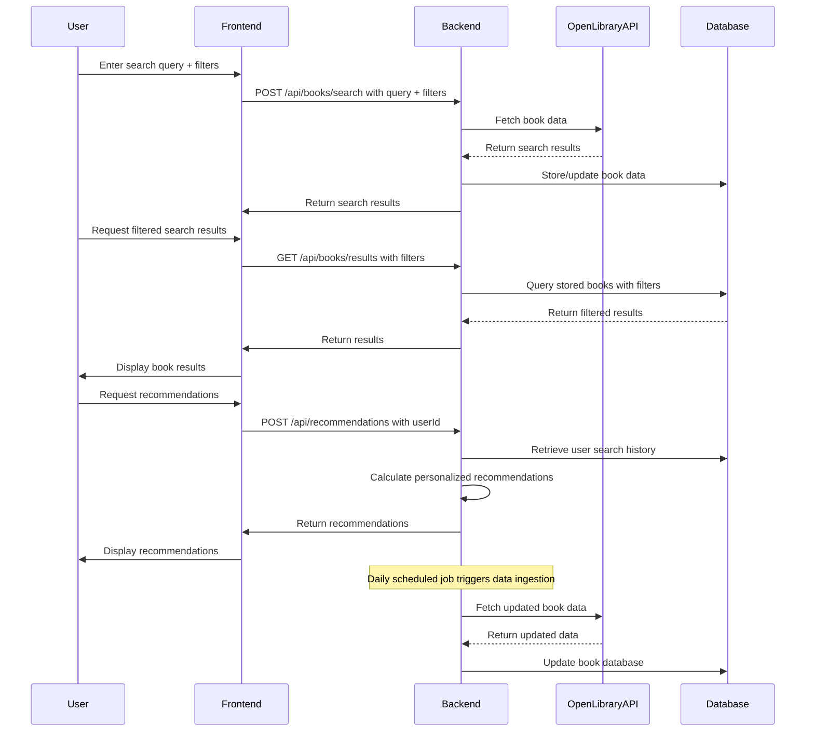

```markdown
# Functional Requirements and API Design for Book Search and Recommendation Application

## API Endpoints

### 1. Search Books  
- **Endpoint:** `/api/books/search`  
- **Method:** POST  
- **Description:** Accepts search queries and filters; fetches data from Open Library API and stores/updates book data in the database.  
- **Request Body:**  
```json
{
  "query": "string",
  "filters": {
    "genre": "string",           // optional
    "publicationYear": "number", // optional
    "author": "string"           // optional
  }
}
```  
- **Response:**  
```json
{
  "results": [
    {
      "bookId": "string",
      "title": "string",
      "author": "string",
      "coverImage": "string",
      "genre": "string",
      "publicationYear": "number"
    }
  ]
}
```

---

### 2. Get Search Results  
- **Endpoint:** `/api/books/results`  
- **Method:** GET  
- **Description:** Retrieves previously searched book results (from DB/cache) with optional server-side filtering.  
- **Query Parameters (optional):** `genre`, `publicationYear`, `author`  
- **Response:** Same as Search Books response results array.

---

### 3. Get Weekly Report  
- **Endpoint:** `/api/reports/weekly`  
- **Method:** GET  
- **Description:** Retrieves weekly aggregated report on most searched books and user preferences.  
- **Response:**  
```json
{
  "mostSearchedBooks": [
    {
      "bookId": "string",
      "title": "string",
      "searchCount": "number"
    }
  ],
  "userPreferencesSummary": {
    "topGenres": ["string"],
    "topAuthors": ["string"]
  }
}
```

---

### 4. Get Recommendations  
- **Endpoint:** `/api/recommendations`  
- **Method:** POST  
- **Description:** Generates personalized book recommendations based on user's previous searches.  
- **Request Body:**  
```json
{
  "userId": "string"
}
```  
- **Response:**  
```json
{
  "recommendations": [
    {
      "bookId": "string",
      "title": "string",
      "author": "string",
      "coverImage": "string"
    }
  ]
}
```

---

### 5. Data Ingestion Trigger  
- **Endpoint:** `/api/ingestion/trigger`  
- **Method:** POST  
- **Description:** Manually triggers daily data ingestion workflow to fetch and update books database. (Scheduled to run daily automatically)  
- **Request Body:** Empty  
- **Response:**  
```json
{
  "status": "started"
}
```

---

## User-App Interaction Sequence Diagram



---

## User Journey Diagram

```mermaid
flowchart TD
    A[User opens app]
    B[User inputs search query]
    C[Backend fetches & stores book data]
    D[User views search results]
    E[User applies filters]
    F[Filtered results displayed]
    G[User requests recommendations]
    H[Backend computes & returns recommendations]
    I[User views personalized recommendations]
    J[Weekly report generated (scheduled)]
    K[User/admin views reports]

    A --> B --> C --> D
    D --> E --> F
    F --> G --> H --> I
    J --> K
```
```