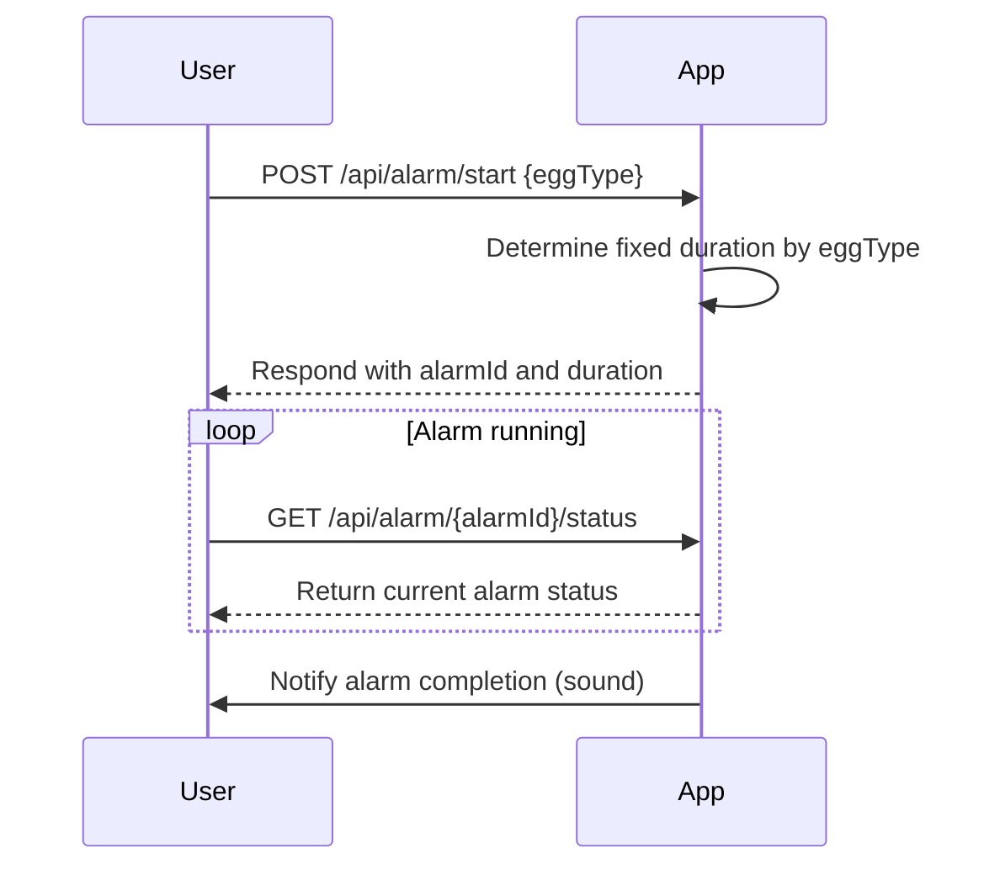
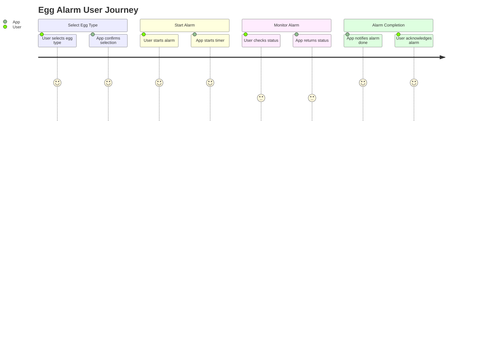

```markdown
# Egg Alarm App - Final Functional Requirements and API Design

## Functional Requirements
- User selects egg type: soft-boiled, medium-boiled, or hard-boiled.
- Fixed timer durations per egg type:
  - Soft-boiled: 4 minutes
  - Medium-boiled: 7 minutes
  - Hard-boiled: 10 minutes
- User starts an alarm for the selected egg type.
- User can retrieve the current status of the alarm.
- Only one alarm can run at a time.
- Alarm triggers a sound notification when the timer ends.

---

## API Endpoints

### 1. Start Alarm (POST `/api/alarm/start`)
- **Description:** Starts an egg alarm based on the selected egg type.
- **Request:**
```json
{
  "eggType": "soft" | "medium" | "hard"
}
```
- **Response:**
```json
{
  "alarmId": "string",
  "eggType": "soft" | "medium" | "hard",
  "durationSeconds": 240,
  "startTime": "2024-06-01T12:00:00Z",
  "status": "running"
}
```

### 2. Get Alarm Status (GET `/api/alarm/{alarmId}/status`)
- **Description:** Retrieves the current status of the alarm.
- **Response:**
```json
{
  "alarmId": "string",
  "eggType": "soft" | "medium" | "hard",
  "durationSeconds": 240,
  "startTime": "2024-06-01T12:00:00Z",
  "elapsedSeconds": 120,
  "status": "running" | "completed"
}
```

---

## User-App Interaction Sequence Diagram



---

## User Journey Diagram


```