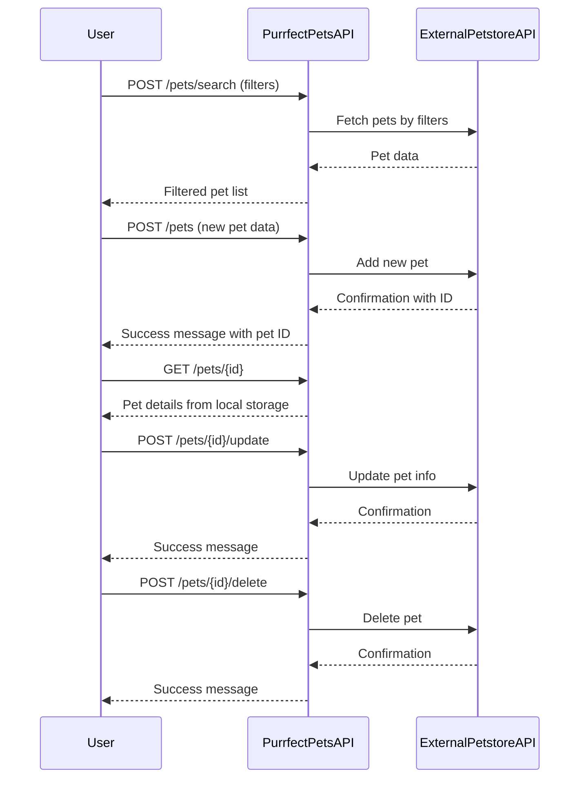

```markdown
# Purrfect Pets API - Functional Requirements

## Overview
The "Purrfect Pets" API app interacts with Petstore API data and provides a set of RESTful endpoints. All business logic that involves external data retrieval or calculations will be done in `POST` endpoints, while `GET` endpoints serve only to retrieve cached or processed results from our app.

---

## API Endpoints

### 1. Search Pets
- **Endpoint:** `POST /pets/search`
- **Description:** Search pets by filters such as type, status, or name. This triggers fetching and processing data from the external Petstore API.
- **Request Body (JSON):**
  ```json
  {
    "type": "string (optional)",
    "status": "string (optional)",
    "name": "string (optional)"
  }
  ```
- **Response Body (JSON):**
  ```json
  [
    {
      "id": "integer",
      "name": "string",
      "type": "string",
      "status": "string",
      "photoUrls": ["string", ...]
    },
    ...
  ]
  ```

### 2. Add New Pet
- **Endpoint:** `POST /pets`
- **Description:** Add a new pet to the system and external Petstore API.
- **Request Body (JSON):**
  ```json
  {
    "name": "string",
    "type": "string",
    "status": "string",
    "photoUrls": ["string", ...]
  }
  ```
- **Response Body (JSON):**
  ```json
  {
    "id": "integer",
    "message": "Pet added successfully"
  }
  ```

### 3. Update Pet
- **Endpoint:** `POST /pets/{id}/update`
- **Description:** Update pet details by ID. Business logic updates external Petstore API.
- **Request Body (JSON):**
  ```json
  {
    "name": "string (optional)",
    "type": "string (optional)",
    "status": "string (optional)",
    "photoUrls": ["string", ...] (optional)
  }
  ```
- **Response Body (JSON):**
  ```json
  {
    "id": "integer",
    "message": "Pet updated successfully"
  }
  ```

### 4. Delete Pet
- **Endpoint:** `POST /pets/{id}/delete`
- **Description:** Delete a pet by ID, invoking external API deletion.
- **Request Body:** None
- **Response Body (JSON):**
  ```json
  {
    "id": "integer",
    "message": "Pet deleted successfully"
  }
  ```

### 5. Get Pet by ID
- **Endpoint:** `GET /pets/{id}`
- **Description:** Retrieve pet details from the local app cache/storage.
- **Response Body (JSON):**
  ```json
  {
    "id": "integer",
    "name": "string",
    "type": "string",
    "status": "string",
    "photoUrls": ["string", ...]
  }
  ```

### 6. List All Pets
- **Endpoint:** `GET /pets`
- **Description:** Retrieve list of all pets from local app storage.
- **Response Body (JSON):**
  ```json
  [
    {
      "id": "integer",
      "name": "string",
      "type": "string",
      "status": "string",
      "photoUrls": ["string", ...]
    },
    ...
  ]
  ```

---

## User-App Interaction Sequence


```