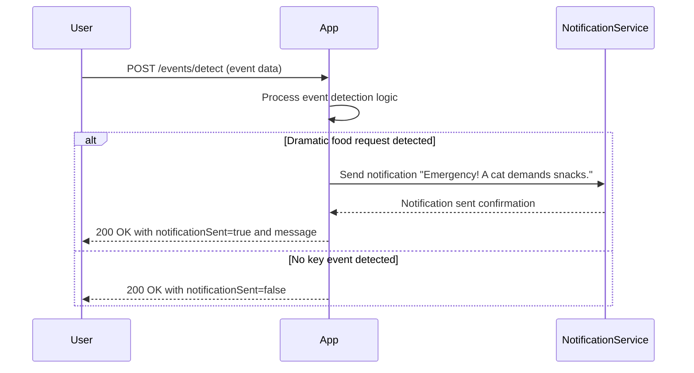
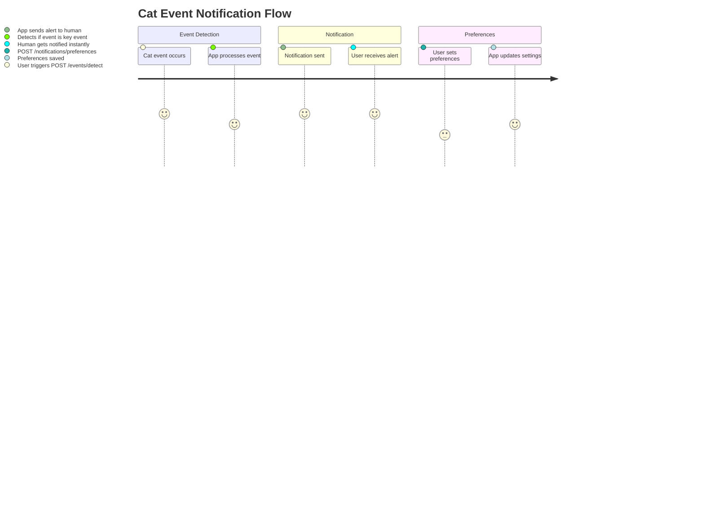

# Functional Requirements and API Design for Cat Event Detection App

## API Endpoints

### 1. POST /events/detect  
**Purpose:** Receive cat event data (e.g., dramatic food requests), process detection logic, and trigger notifications if necessary.

- **Request Body:**
```json
{
  "catId": "string",
  "eventType": "string",         // e.g., "dramatic_food_request"
  "eventTimestamp": "string"     // ISO 8601 datetime
}
```

- **Response Body:**
```json
{
  "notificationSent": true,
  "message": "Emergency! A cat demands snacks."
}
```

---

### 2. GET /notifications  
**Purpose:** Retrieve a list of recent notifications sent by the system.

- **Response Body:**
```json
[
  {
    "notificationId": "string",
    "catId": "string",
    "eventType": "string",
    "timestamp": "string",
    "message": "string"
  }
]
```

---

### 3. POST /notifications/preferences  
**Purpose:** Set or update notification preferences for a cat or user.

- **Request Body:**
```json
{
  "catId": "string",
  "notificationType": "string",  // e.g., "push", "email", "sms"
  "enabled": true
}
```

- **Response Body:**
```json
{
  "success": true,
  "message": "Preferences updated."
}
```

---

# Mermaid Sequence Diagram: User-App Interaction



---

# Mermaid Journey Diagram: Cat Event Notification Flow

