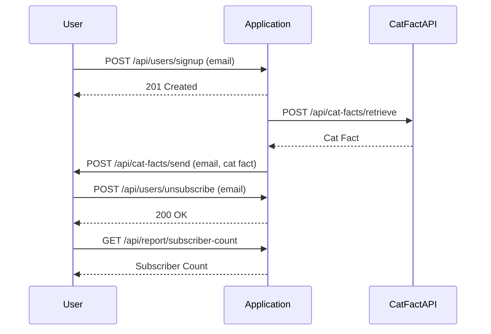

# Final Functional Requirements for Cat Fact Subscription Service

## API Endpoints

### 1. User Sign-Up
- **Endpoint**: `POST /api/users/signup`
- **Request**:
  ```json
  {
    "email": "user@example.com"
  }
  ```
- **Response**:
  - Status 201 Created
  - Body:
    ```json
    {
      "message": "User signed up successfully."
    }
    ```

### 2. Retrieve Cat Fact
- **Endpoint**: `POST /api/cat-facts/retrieve`
- **Request**:
  - No body required
- **Response**:
  ```json
  {
    "fact": "Cats have five toes on their front paws, but only four toes on their back paws."
  }
  ```

### 3. Send Weekly Cat Fact
- **Endpoint**: `POST /api/cat-facts/send`
- **Request**:
  - No body required
- **Response**:
  - Status 200 OK
  - Body:
    ```json
    {
      "message": "Weekly cat fact sent to all subscribers."
    }
    ```

### 4. Unsubscribe
- **Endpoint**: `POST /api/users/unsubscribe`
- **Request**:
  ```json
  {
    "email": "user@example.com"
  }
  ```
- **Response**:
  - Status 200 OK
  - Body:
    ```json
    {
      "message": "User unsubscribed successfully."
    }
    ```

### 5. Get Subscriber Count
- **Endpoint**: `GET /api/report/subscriber-count`
- **Response**:
  ```json
  {
    "count": 100
  }
  ```

## User-App Interaction



These requirements outline the necessary endpoints and interactions to implement the weekly cat fact subscription service. Let me know if there's anything else you need!