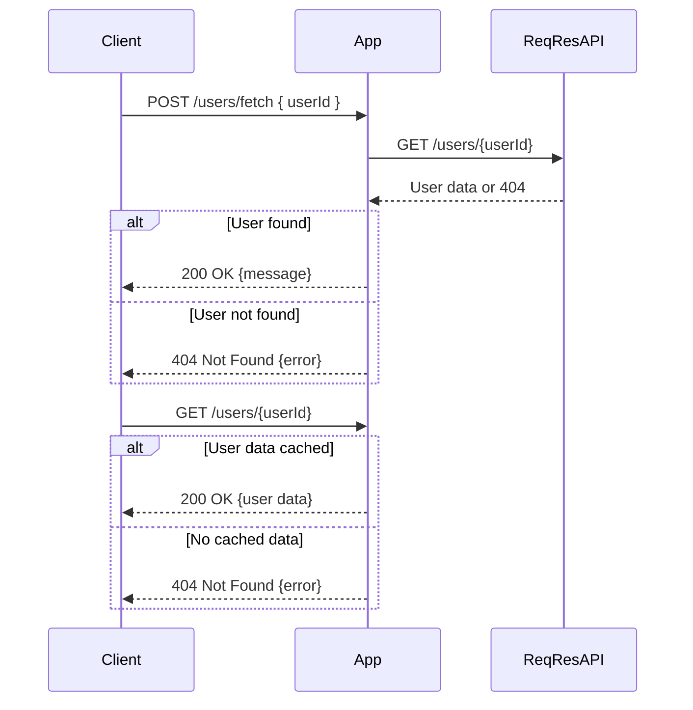
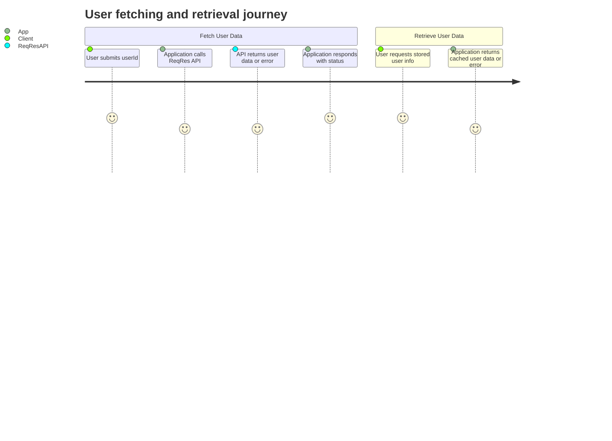

```markdown
# Functional Requirements for User Details Retrieval Application

## API Endpoints

### 1. POST /users/fetch
- **Purpose:** Accept a user ID, call the external ReqRes API to retrieve user details, and store/cache the result internally.
- **Request:**
  ```json
  {
    "userId": 2
  }
  ```
- **Response (Success - 200 OK):**
  ```json
  {
    "message": "User data fetched successfully",
    "userId": 2
  }
  ```
- **Response (Error - 400 Bad Request):**
  ```json
  {
    "error": "Invalid user ID"
  }
  ```
- **Response (Error - 404 Not Found):**
  ```json
  {
    "error": "User not found"
  }
  ```

### 2. GET /users/{userId}
- **Purpose:** Retrieve the stored user details for the given user ID.
- **Response (Success - 200 OK):**
  ```json
  {
    "id": 2,
    "email": "janet.weaver@reqres.in",
    "first_name": "Janet",
    "last_name": "Weaver",
    "avatar": "https://reqres.in/img/faces/2-image.jpg"
  }
  ```
- **Response (Error - 404 Not Found):**
  ```json
  {
    "error": "User data not found. Please fetch first."
  }
  ```

---

## User-App Interaction Sequence Diagram



---

## User Journey Diagram


```