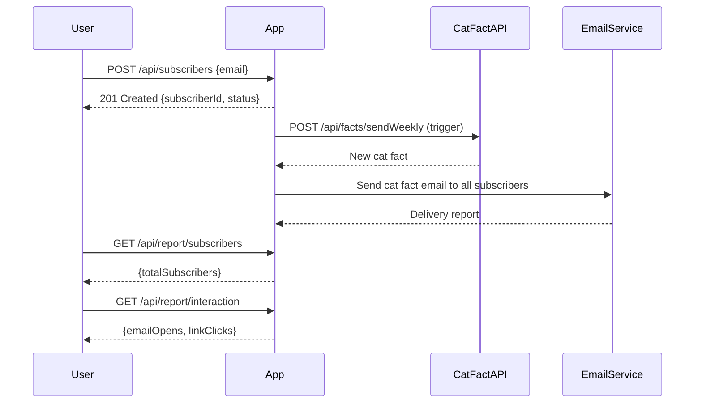

```markdown
# Functional Requirements and API Design for Weekly Cat Fact Subscription Application

## API Endpoints

### 1. User Subscription

- **POST /api/subscribers**
  - Description: Register a new subscriber.
  - Request Body (JSON):
    ```json
    {
      "email": "user@example.com"
    }
    ```
  - Response Body (JSON):
    ```json
    {
      "subscriberId": "uuid",
      "email": "user@example.com",
      "status": "subscribed"
    }
    ```

- **GET /api/subscribers/{subscriberId}**
  - Description: Retrieve subscriber information.
  - Response Body (JSON):
    ```json
    {
      "subscriberId": "uuid",
      "email": "user@example.com",
      "status": "subscribed"
    }
    ```

### 2. Trigger Weekly Fact Ingestion and Email Sending

- **POST /api/facts/sendWeekly**
  - Description: Trigger retrieval of a new cat fact from external API and send it to all subscribers.
  - Request Body: *Empty*
  - Response Body (JSON):
    ```json
    {
      "sentToSubscribers": 123,
      "catFact": "Cats have five toes on their front paws, but only four toes on their back paws."
    }
    ```

### 3. Reporting

- **GET /api/report/subscribers**
  - Description: Get total number of subscribers.
  - Response Body (JSON):
    ```json
    {
      "totalSubscribers": 123
    }
    ```

- **GET /api/report/interaction**
  - Description: Get engagement metrics (email opens, clicks).
  - Response Body (JSON):
    ```json
    {
      "emailOpens": 100,
      "linkClicks": 50
    }
    ```

---

## User-App Interaction Sequence Diagram



---

## Summary

- **POST** endpoints handle all operations involving external data retrieval and actions (subscription creation, fact ingestion + email sending).
- **GET** endpoints are used solely for retrieving stored data and reports.
- Email sending is triggered weekly via a POST endpoint, which can be scheduled.
```