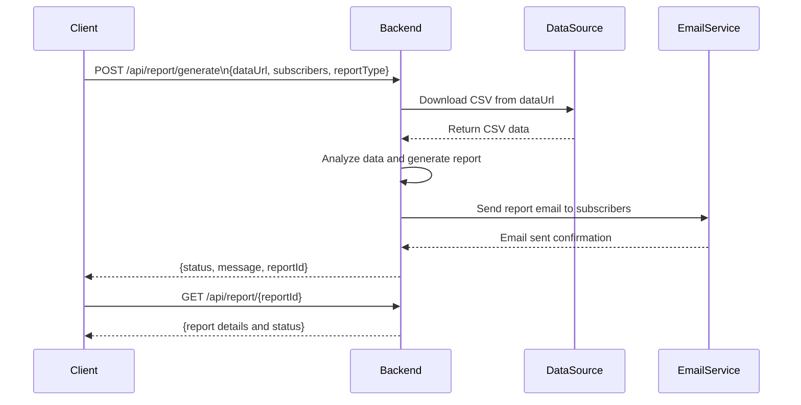

# Functional Requirements and API Design

## API Endpoints

### 1. POST `/api/report/generate`

- **Purpose:**  
  Trigger the process to download data from the given URL, analyze it, and generate a report which will be emailed to subscribers.

- **Request Body (JSON):**
  ```json
  {
    "dataUrl": "string",             // URL to download CSV data from
    "subscribers": ["string"],       // List of email addresses to send the report to
    "reportType": "string"           // Type of report, e.g., "summary", "detailed"
  }
  ```

- **Response (JSON):**
  ```json
  {
    "status": "string",              // e.g., "processing", "completed", "failed"
    "message": "string",             // Optional message or error description
    "reportId": "string"             // Unique ID to retrieve the report later
  }
  ```

---

### 2. GET `/api/report/{reportId}`

- **Purpose:**  
  Retrieve the results or details of a previously generated report.

- **Response (JSON):**
  ```json
  {
    "reportId": "string",
    "generatedAt": "string",         // Timestamp ISO8601
    "status": "string",              // e.g., "processing", "completed", "failed"
    "reportSummary": {               // Summary or analysis results
      // report content varies depending on reportType
    }
  }
  ```

---

# Business Logic Flow

- The client sends a **POST** request to `/api/report/generate` with the data URL, subscribers, and report type.
- The server downloads the CSV data from the specified URL.
- The server analyzes the data (using pandas or equivalent).
- A report is generated and emailed to all subscribers.
- The server returns a `reportId` for tracking.
- The client can query the report status/results with a **GET** request to `/api/report/{reportId}`.

---

# User-App Interaction Diagram

