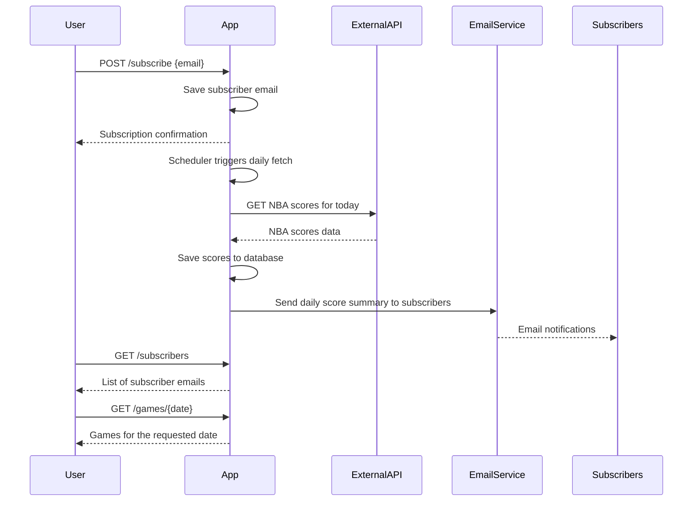
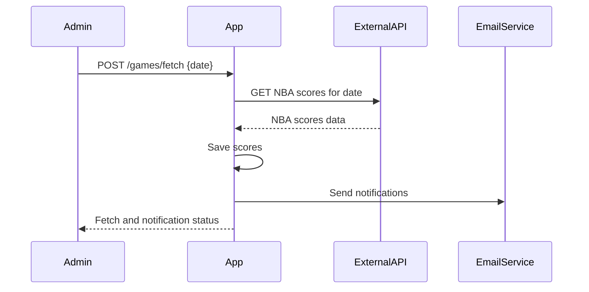

# Functional Requirements and API Specification

## Functional Requirements

1. **Fetch NBA Game Scores Daily**  
   - Fetch NBA game scores daily from an external API asynchronously at a scheduled time (e.g., 6:00 PM UTC).  
   - The fetching process should support manual triggering via an API as well.

2. **Store NBA Game Data Locally**  
   - Persist fetched NBA game data including date, team names, scores, and relevant details indefinitely.

3. **User Subscription System**  
   - Users can subscribe via email to receive daily NBA score notifications.  
   - The system stores subscriber emails and manages the subscription list.

4. **Notification System**  
   - After fetching and storing scores, send a daily email notification to all subscribers with a summary of the day’s NBA games.

5. **API Endpoints**  
   - Provide RESTful APIs for:  
     - Subscribing users (`POST /subscribe`)  
     - Retrieving subscribers list (`GET /subscribers`)  
     - Retrieving all stored games with pagination (`GET /games/all`)  
     - Retrieving games by specific date (`GET /games/{date}`)  
     - Manually triggering data fetch and notification (`POST /games/fetch`)

6. **Background Scheduler**  
   - Automate daily fetching and notification sending without manual API invocation.

---

## API Endpoints

### POST /subscribe  
Request:  
```json
{
  "email": "user@example.com"
}
```  
Response:  
```json
{
  "message": "Subscription successful",
  "email": "user@example.com"
}
```

### POST /games/fetch  
Request:  
```json
{
  "date": "YYYY-MM-DD"  // Optional, defaults to current date
}
```  
Response:  
```json
{
  "message": "Scores fetched and notifications sent",
  "date": "YYYY-MM-DD",
  "gamesCount": 10
}
```

### GET /subscribers  
Response:  
```json
[
  "user1@example.com",
  "user2@example.com"
]
```

### GET /games/all?limit=20&offset=0  
Response:  
```json
[
  {
    "gameId": "123",
    "date": "YYYY-MM-DD",
    "homeTeam": "Team A",
    "awayTeam": "Team B",
    "homeScore": 100,
    "awayScore": 98
  }
]
```

### GET /games/{date}  
Response:  
```json
[
  {
    "gameId": "123",
    "date": "YYYY-MM-DD",
    "homeTeam": "Team A",
    "awayTeam": "Team B",
    "homeScore": 100,
    "awayScore": 98
  }
]
```

---

## User-App Interaction Sequence Diagram



---

## Manual Fetch and Notification Trigger Flow


