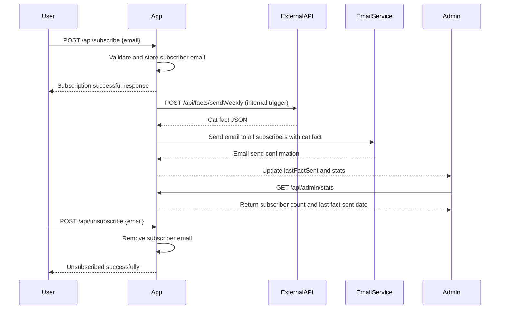

```markdown
# Functional Requirements and API Specification

## API Endpoints

### 1. User Subscription

- **POST /api/subscribe**  
  Allows a user to subscribe with their email.

  **Request:**
  ```json
  {
    "email": "user@example.com"
  }
  ```

  **Response:**
  ```json
  {
    "message": "Subscription successful",
    "subscriberId": "uuid"
  }
  ```

### 2. Trigger Weekly Cat Fact Ingestion & Email Send-out

- **POST /api/facts/sendWeekly**  
  Retrieves a new cat fact from the external API and sends it to all subscribers.

  **Request:** Empty body `{}`

  **Response:**
  ```json
  {
    "message": "Weekly cat fact sent",
    "fact": "Cats sweat through their paws."
  }
  ```

### 3. Retrieve Subscriber Count and Basic Stats (Admin Dashboard)

- **GET /api/admin/stats**  
  Returns subscriber count and basic stats.

  **Response:**
  ```json
  {
    "totalSubscribers": 1234,
    "lastFactSent": "2024-06-01T10:00:00Z"
  }
  ```

### 4. Unsubscribe User

- **POST /api/unsubscribe**  
  Allows a user to unsubscribe using their email.

  **Request:**
  ```json
  {
    "email": "user@example.com"
  }
  ```

  **Response:**
  ```json
  {
    "message": "Unsubscribed successfully"
  }
  ```

---

## Visual Representation of User-App Interaction


```