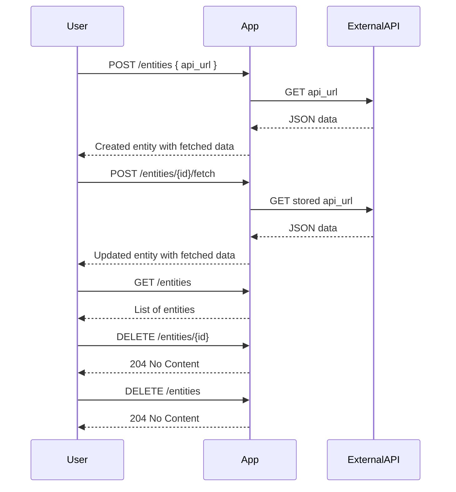

```markdown
# Functional Requirements and API Endpoints

## Entity
- Fields:
  - `id` (UUID, generated)
  - `api_url` (JsonNode, validated URL string)
  - `fetched_data` (JsonNode, nullable)
  - `fetched_at` (timestamp, nullable)

---

## API Endpoints

### 1. Create Entity and Fetch Data
- **POST** `/entities`
- **Request body:**
  ```json
  {
    "api_url": "<string, valid URL>"
  }
  ```
- **Response:**
  ```json
  {
    "id": "<UUID>",
    "api_url": "<string>",
    "fetched_data": <JSON from external API>,
    "fetched_at": "<timestamp>"
  }
  ```
- **Behavior:**
  - Create new entity with `api_url`.
  - Immediately fetch data from the provided API URL.
  - Save fetched data and timestamp in the entity.

---

### 2. Update Entity API URL and Fetch Data
- **POST** `/entities/{id}`
- **Request body:**
  ```json
  {
    "api_url": "<string, valid URL>"
  }
  ```
- **Response:**
  ```json
  {
    "id": "<UUID>",
    "api_url": "<string>",
    "fetched_data": <JSON from external API>,
    "fetched_at": "<timestamp>"
  }
  ```
- **Behavior:**
  - Update entity's `api_url`.
  - Immediately fetch data from updated API URL.
  - Update `fetched_data` and `fetched_at`.

---

### 3. Trigger Manual Data Fetching
- **POST** `/entities/{id}/fetch`
- **Request body:** *empty*
- **Response:**
  ```json
  {
    "id": "<UUID>",
    "api_url": "<string>",
    "fetched_data": <JSON from external API>,
    "fetched_at": "<timestamp>"
  }
  ```
- **Behavior:**
  - Fetch data from entity's stored `api_url`.
  - Update `fetched_data` and `fetched_at`.

---

### 4. Get All Entities
- **GET** `/entities`
- **Response:**
  ```json
  [
    {
      "id": "<UUID>",
      "api_url": "<string>",
      "fetched_data": <JSON or null>,
      "fetched_at": "<timestamp or null>"
    },
    ...
  ]
  ```
- **Behavior:**
  - Return list of all entities with current data.

---

### 5. Delete Single Entity
- **DELETE** `/entities/{id}`
- **Response:** HTTP 204 No Content

---

### 6. Delete All Entities
- **DELETE** `/entities`
- **Response:** HTTP 204 No Content

---

# Mermaid Sequence Diagram: User Interaction Flow


```
