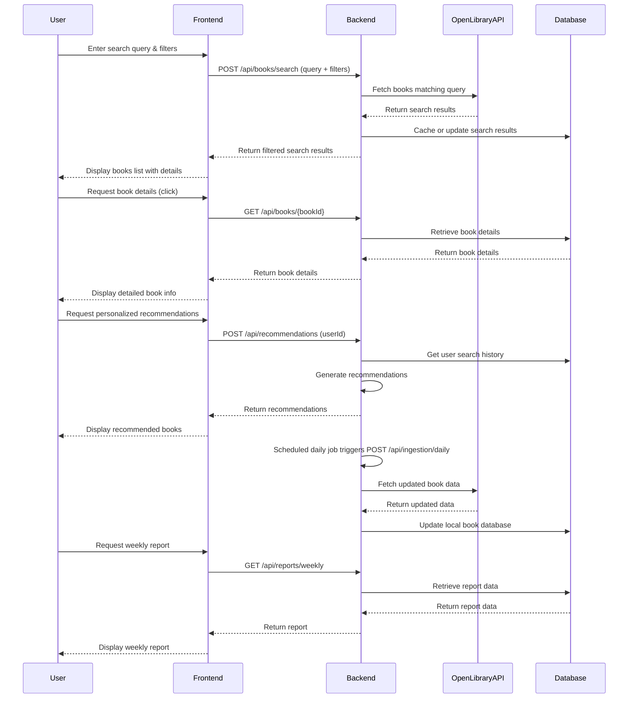

# Functional Requirements and API Design for Book Search and Recommendation Application

## API Endpoints

### 1. Search Books  
**POST /api/books/search**  
- **Description:** Search books via Open Library API based on user query and filters. External data fetching and filtering logic executed here.  
- **Request Body:**  
```json
{
  "query": "string",            // search keywords
  "filters": {                  // optional filters
    "genre": "string",
    "publicationYear": "number",
    "author": "string"
  }
}
```  
- **Response:**  
```json
{
  "results": [
    {
      "title": "string",
      "author": "string",
      "coverImageUrl": "string",
      "genre": "string",
      "publicationYear": "number",
      "bookId": "string"
    }
  ]
}
```

---

### 2. Get Book Details  
**GET /api/books/{bookId}**  
- **Description:** Retrieve detailed information of a specific book from local database or cache (no external call).  
- **Response:**  
```json
{
  "title": "string",
  "author": "string",
  "coverImageUrl": "string",
  "genre": "string",
  "publicationYear": "number",
  "description": "string",
  "publisher": "string",
  "isbn": "string"
}
```

---

### 3. Generate Weekly Report  
**GET /api/reports/weekly**  
- **Description:** Retrieve weekly report data on most searched books and user preferences.  
- **Response:**  
```json
{
  "weekStart": "YYYY-MM-DD",
  "weekEnd": "YYYY-MM-DD",
  "mostSearchedBooks": [
    {
      "title": "string",
      "searchCount": "number"
    }
  ],
  "userPreferences": {
    "topGenres": ["string"],
    "topAuthors": ["string"]
  }
}
```

---

### 4. Get Personalized Recommendations  
**POST /api/recommendations**  
- **Description:** Generate personalized book recommendations based on user’s previous searches. Business logic to compute recommendations is executed here.  
- **Request Body:**  
```json
{
  "userId": "string"
}
```  
- **Response:**  
```json
{
  "recommendations": [
    {
      "title": "string",
      "author": "string",
      "coverImageUrl": "string",
      "reason": "string"  // e.g. "Based on your search for 'Fantasy'"
    }
  ]
}
```

---

### 5. Data Ingestion Trigger (Scheduled)  
**POST /api/ingestion/daily**  
- **Description:** Trigger daily ingestion job to update the local book database by fetching data from Open Library API.  
- **Request Body:** Empty  
- **Response:**  
```json
{
  "status": "started",
  "message": "Daily ingestion process triggered"
}
```

---

## User-App Interaction Sequence Diagram

