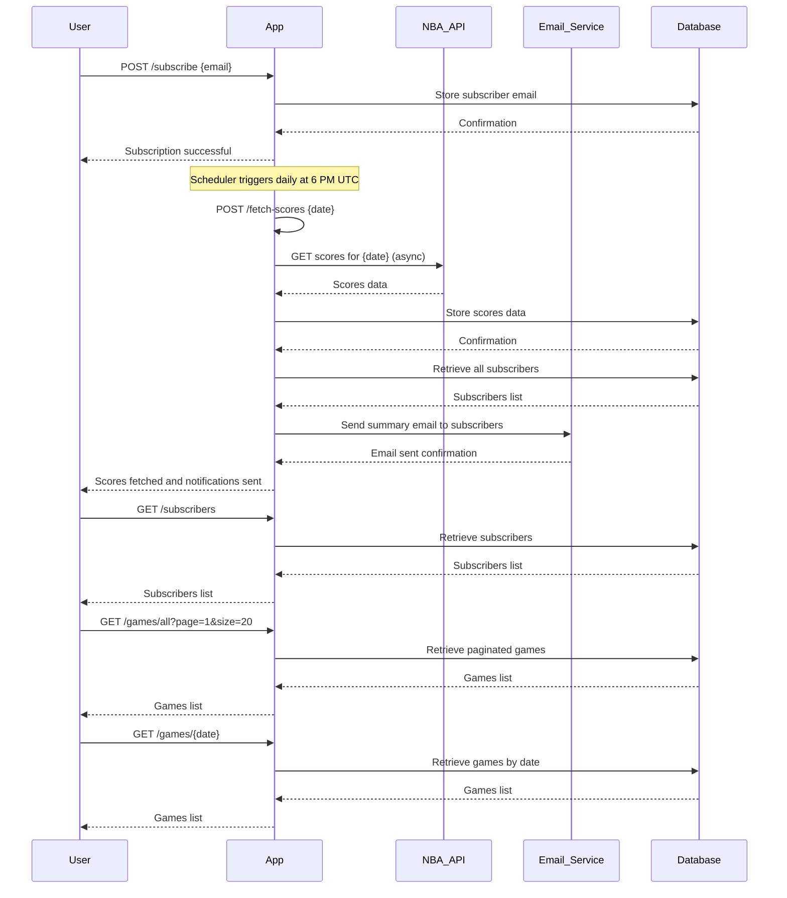

# Functional Requirements and API Design

## API Endpoints

### 1. Subscribe to Notifications  
**POST /subscribe**  
- **Description:** Adds a user email to the subscription list.  
- **Request Body:**  
```json
{
  "email": "user@example.com"
}
```  
- **Response:**  
```json
{
  "message": "Subscription successful"
}
```

### 2. Fetch and Store NBA Scores (Triggered internally by scheduler or manually)  
**POST /fetch-scores**  
- **Description:** Fetches NBA game scores from external API for the given date, stores them locally, and triggers notification emails.  
- **Request Body:**  
```json
{
  "date": "YYYY-MM-DD"
}
```  
- **Response:**  
```json
{
  "message": "Scores fetched and notifications sent",
  "date": "YYYY-MM-DD",
  "gamesCount": 12
}
```

### 3. Get All Subscribers  
**GET /subscribers**  
- **Description:** Returns a list of all subscribed emails.  
- **Response:**  
```json
{
  "subscribers": [
    "user1@example.com",
    "user2@example.com"
  ]
}
```

### 4. Get All Stored Games  
**GET /games/all**  
- **Description:** Retrieves all stored NBA games data. Supports optional pagination via query parameters `page` and `size`.  
- **Response:**  
```json
{
  "games": [
    {
      "gameId": 123,
      "date": "YYYY-MM-DD",
      "homeTeam": "Team A",
      "awayTeam": "Team B",
      "homeScore": 102,
      "awayScore": 99
    },
    ...
  ],
  "page": 1,
  "size": 20,
  "total": 100
}
```

### 5. Get Games by Date  
**GET /games/{date}**  
- **Description:** Retrieves all NBA games for a specific date.  
- **Response:**  
```json
{
  "date": "YYYY-MM-DD",
  "games": [
    {
      "gameId": 123,
      "homeTeam": "Team A",
      "awayTeam": "Team B",
      "homeScore": 102,
      "awayScore": 99
    },
    ...
  ]
}
```

---

## User-App Interaction Sequence (Mermaid Diagram)

