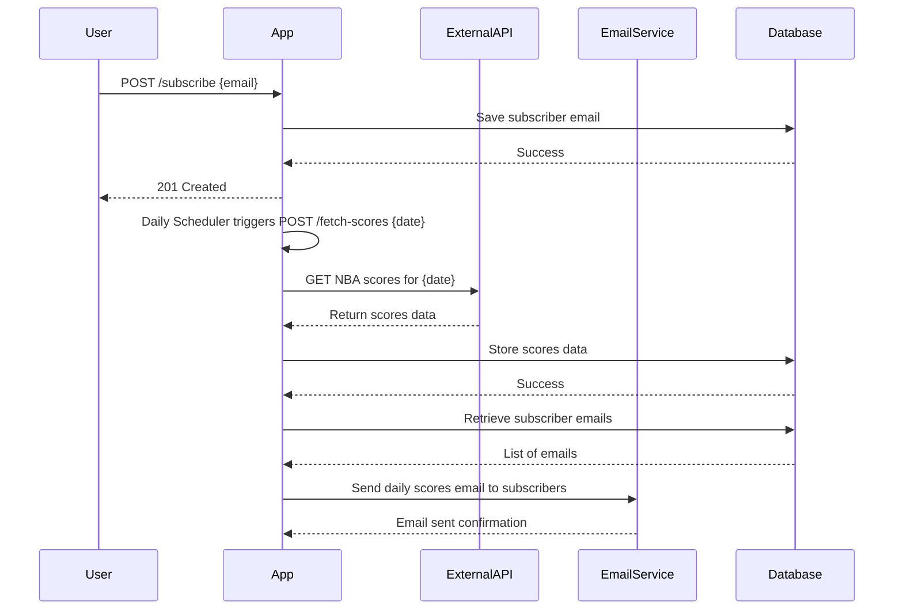
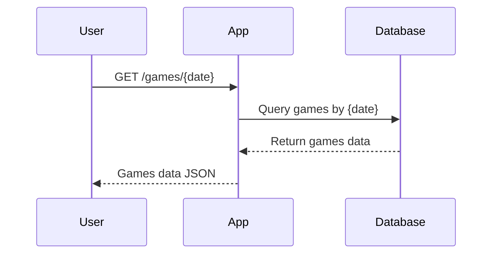

# Functional Requirements and API Design

## API Endpoints

### 1. POST /subscribe  
**Description:** User subscribes to daily NBA score notifications.  
**Request Body:**  
```json
{
  "email": "user@example.com"
}
```  
**Response:**  
- `201 Created` on success  
- `400 Bad Request` if email is invalid or already subscribed  

### 2. POST /fetch-scores  
**Description:** Trigger fetching NBA scores for a given date from external API, store results, and send notifications.  
**Request Body:**  
```json
{
  "date": "YYYY-MM-DD"
}
```  
**Response:**  
- `200 OK` with summary of processed data  
- `400 Bad Request` if date format invalid or other errors  

### 3. GET /subscribers  
**Description:** Retrieve all subscribed email addresses.  
**Response:**  
```json
[
  "user1@example.com",
  "user2@example.com"
]
```

### 4. GET /games/all  
**Description:** Retrieve all stored NBA games.  
**Response:**  
```json
[
  {
    "date": "YYYY-MM-DD",
    "homeTeam": "Team A",
    "awayTeam": "Team B",
    "homeScore": 100,
    "awayScore": 90
  }
]
```  

### 5. GET /games/{date}  
**Description:** Retrieve all NBA games for the specified date.  
**Response:** Same as above but filtered by `date`.  

---

## Business Logic Notes  

- External API calls happen only inside the `POST /fetch-scores` endpoint or scheduler trigger calling the same logic.  
- GET endpoints serve stored data only, no external calls or calculations.  
- Scheduler triggers `POST /fetch-scores` daily at the configured time with the current date.  
- After fetching and storing data, email notifications are sent to all subscribers with the summary of that day’s scores.  
- Duplicate subscriber emails are not allowed (unique emails enforced).  
- Email notifications are sent in detailed HTML format including game stats.  
- `GET /games/all` returns all stored games without pagination or filtering.

---

## User-App Interaction Sequence



---

## User Request to Retrieve Data


