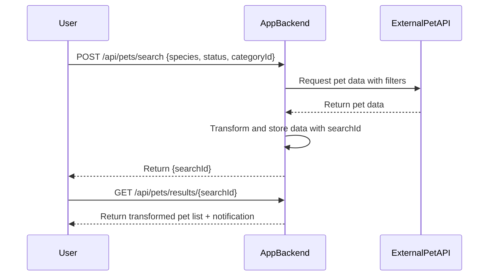
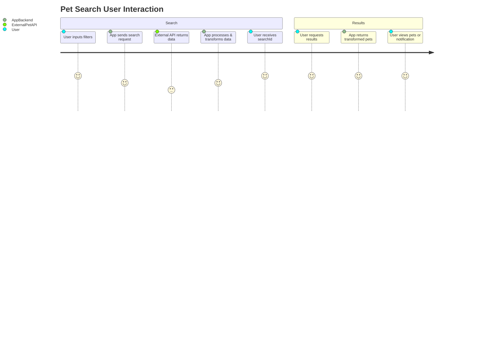

```markdown
# Functional Requirements for Filtered Pet Search Application

## API Endpoints

### 1. POST /api/pets/search  
**Description:**  
Fetch pet details from external API based on search parameters, perform transformation, and store results for retrieval.

**Request Body:**  
```json
{
  "species": "string",      // optional, e.g. "dog"
  "status": "string",       // optional, e.g. "available"
  "categoryId": "integer"   // optional
}
```

**Response:**  
```json
{
  "searchId": "string",     // unique ID to retrieve results
  "message": "Search initiated"
}
```

---

### 2. GET /api/pets/results/{searchId}  
**Description:**  
Retrieve the transformed pet list for a given search ID.

**Response:**  
```json
{
  "pets": [
    {
      "Name": "string",
      "Species": "string",
      "CategoryId": "integer",
      "Availability": "string",
      "OtherAttributes": "..."
    }
  ],
  "notification": "string"  // e.g. "No pets found" or empty string
}
```

---

## Business Logic

- The POST /search endpoint triggers:
  - Validation of input parameters.
  - Calling the external PetStore API with given filters.
  - Transformation of received data (e.g., renaming "petName" to "Name", adding availability status).
  - Persisting transformed results with a generated `searchId`.
- The GET /results endpoint fetches the stored transformed pet list by `searchId`.
- If no pets found, a notification message is included in the response.

---

## User-App Interaction Sequence



---

## User Interaction Journey


```