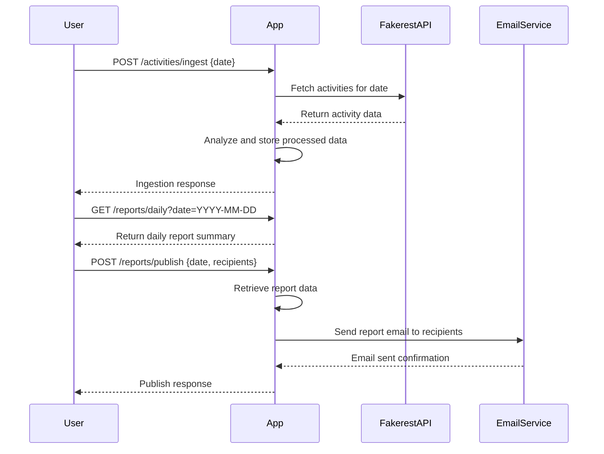
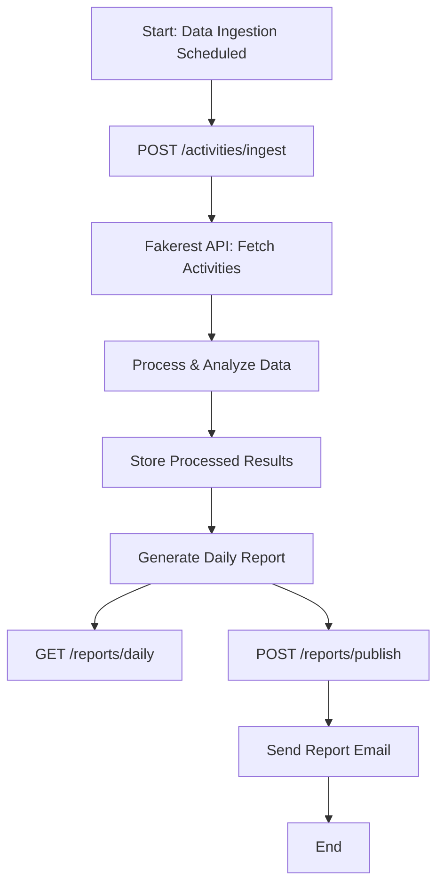

# Activity Tracker Application Functional Requirements

## API Endpoints

### 1. POST /activities/ingest  
**Description:** Trigger data ingestion from the Fakerest API and process user activity data (fetch, analyze patterns).  
**Request:**  
```json
{
  "date": "YYYY-MM-DD"  // Optional: date for which to fetch activities, defaults to current date
}
```  
**Response:**  
```json
{
  "status": "success",
  "ingestedCount": 123,
  "message": "Activities ingested and processed for the date."
}
```

---

### 2. GET /reports/daily  
**Description:** Retrieve generated daily activity report summary.  
**Request Parameters:**  
- `date` (query param, required): Date of the report in `YYYY-MM-DD` format  
**Response:**  
```json
{
  "date": "YYYY-MM-DD",
  "totalActivities": 150,
  "frequentActivityTypes": ["Running", "Cycling"],
  "anomalies": [
    "User 42 showed unusually high activity",
    "No activities recorded for User 7"
  ]
}
```

---

### 3. POST /reports/publish  
**Description:** Trigger sending the daily report to admin email(s).  
**Request:**  
```json
{
  "date": "YYYY-MM-DD",
  "recipients": ["admin@example.com"]  // optional, defaults to configured admin email
}
```  
**Response:**  
```json
{
  "status": "success",
  "message": "Daily report sent to recipients."
}
```

---

## Business Logic Notes

- The POST `/activities/ingest` endpoint fetches activity data from the Fakerest API, processes it to identify patterns (frequency, types, anomalies), and stores the processed results internally.
- The GET `/reports/daily` endpoint reads processed reports from internal storage.
- The POST `/reports/publish` endpoint retrieves the report and sends it via email to the specified recipients.

---

## User-App Interaction Sequence Diagram



---

## Activity Data Flow Journey

