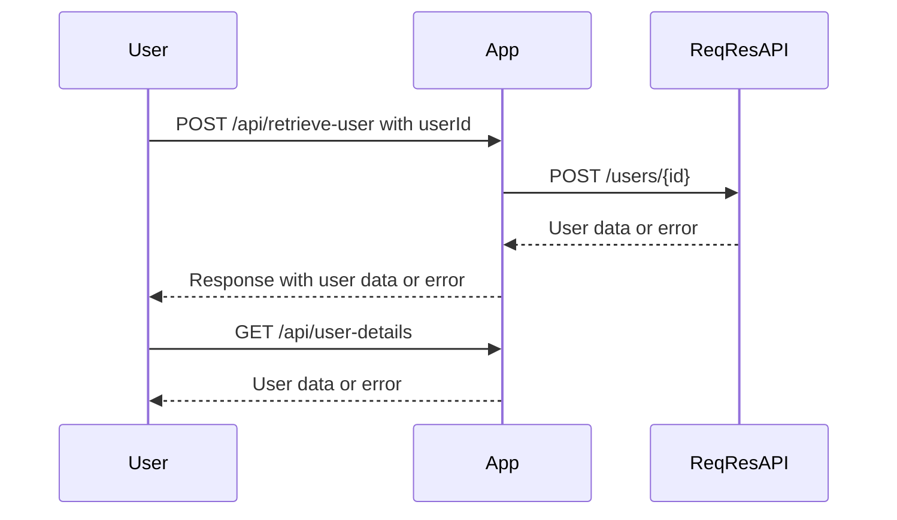

# Final Version of Functional Requirements for User Details Retrieval Application

## API Endpoints

### 1. Retrieve User Details (External Data Source)
- **Endpoint**: `/api/retrieve-user`
- **Method**: `POST`
- **Description**: This endpoint retrieves a user's details from the ReqRes API using the provided user ID.
- **Request Format**:
  ```json
  {
    "userId": "integer"
  }
  ```
- **Response Format**:
  - **Success**:
    ```json
    {
      "id": "integer",
      "email": "string",
      "first_name": "string",
      "last_name": "string",
      "avatar": "string"
    }
    ```
  - **Error**:
    ```json
    {
      "error": "string"
    }
    ```

### 2. Get Retrieved User Details
- **Endpoint**: `/api/user-details`
- **Method**: `GET`
- **Description**: This endpoint returns the details of the user that was previously retrieved and stored.
- **Response Format**:
  - **Success**:
    ```json
    {
      "id": "integer",
      "email": "string",
      "first_name": "string",
      "last_name": "string",
      "avatar": "string"
    }
    ```
  - **Error**:
    ```json
    {
      "error": "string"
    }
    ```

## User-App Interaction Diagram

