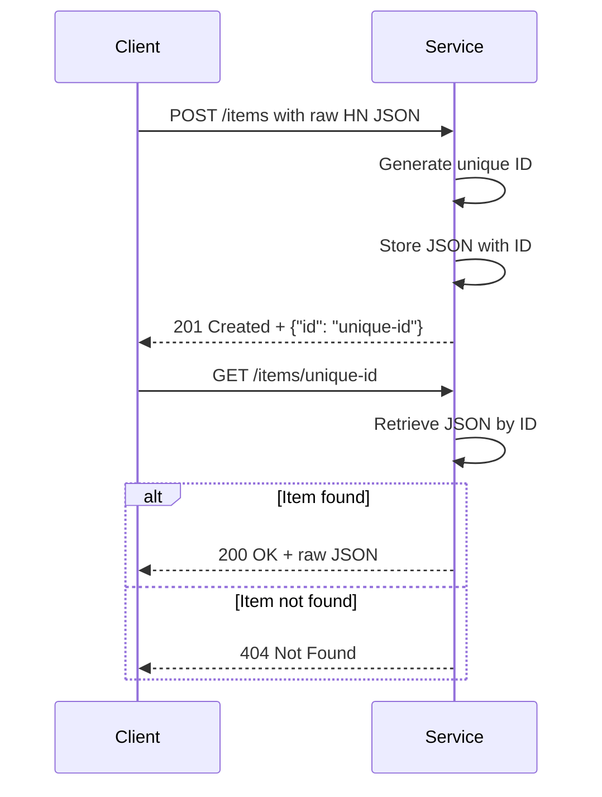

# Functional Requirements for Hacker News Item Storage Service

## API Endpoints

### 1. POST /items  
- **Description:** Stores a Hacker News item JSON as received, generates a unique ID, and returns the ID.  
- **Request:**  
  - Content-Type: application/json  
  - Body: Raw JSON representing a Hacker News item (stored as-is, no validation)  
- **Response:**  
  - Status: 201 Created  
  - Body:  
    ```json
    {
      "id": "generated-unique-id"
    }
    ```  
- **Business Logic:**  
  - Generate a unique ID for the item.  
  - Store the raw JSON under this ID in persistent storage.  
  - Return the generated ID.  

---

### 2. GET /items/{id}  
- **Description:** Retrieves the stored Hacker News item JSON by its ID.  
- **Request:**  
  - Path parameter: `id` — the unique ID of the stored item  
- **Response:**  
  - Status: 200 OK  
  - Body: Raw JSON stored for the given `id`  
  - Status: 404 Not Found if no item exists with the given ID  

---

## User-App Interaction Sequence

