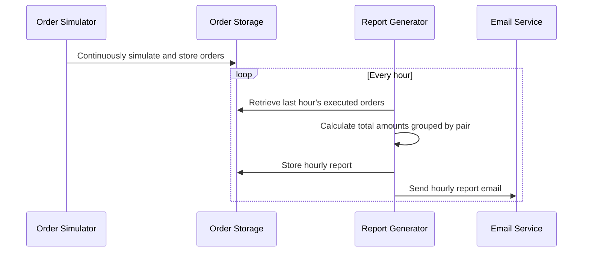

```markdown
# Final Functional Requirements for Background Order Simulation Application

## Application Behavior

- The application will simulate user orders continuously or at a configurable interval in the background without any API endpoints.
- Each order contains the following fields:
  - **price** (decimal)
  - **pair** (string, e.g., "BTC-USD")
  - **amount** (decimal)
  - **timestamp** (ISO 8601 datetime)
  - **status** (enum: "rejected" or "executed")
  - **side** (enum: "buy" or "sell")
  - **userId** (string)
- Orders are generated randomly with reasonable distributions for status and side.
- Every hour, the application automatically:
  - Retrieves all orders from the last hour.
  - Calculates the total executed amount grouped by each trading pair.
  - Generates and stores an hourly report with these aggregated totals.
  - Sends an email containing the hourly report summary.
- No public API endpoints will be exposed; all processing and emailing run autonomously in the background.

---

## Background Workflow Sequence Diagram



---

## Summary

- Fully autonomous background order simulation, reporting, and emailing.
- No external triggers or API endpoints.
- Internal data management and hourly aggregation of executed order volumes per pair.
```

If you have no further questions, I can now proceed to implementation. Would you like me to finish?