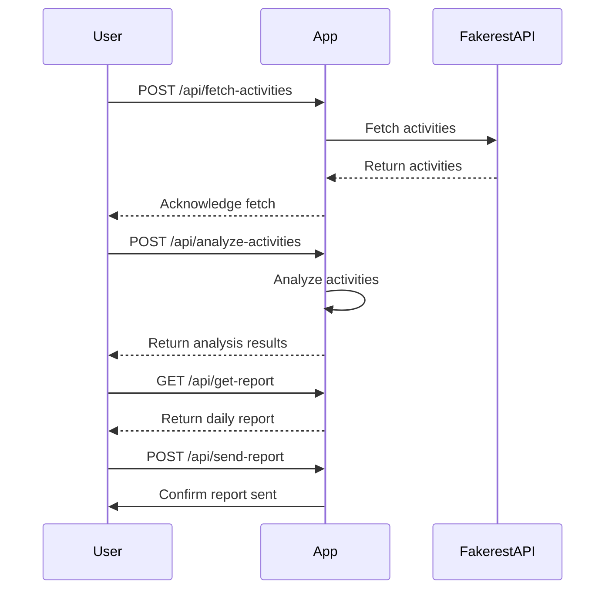

Certainly! Here is the final version of the functional requirements for the Activity Tracker Application:

# Functional Requirements for Activity Tracker Application

## API Endpoints

### 1. Fetch User Activities
- **Endpoint:** `/api/fetch-activities`
- **Method:** POST
- **Description:** Fetch user activities from the Fakerest API and store them for processing.
- **Request Format:**
  ```json
  {
    "apiUrl": "https://fakerestapi.azurewebsites.net/api/Activities",
    "startDate": "YYYY-MM-DD",
    "endDate": "YYYY-MM-DD"
  }
  ```
- **Response Format:**
  ```json
  {
    "status": "success",
    "message": "Activities fetched and stored successfully."
  }
  ```

### 2. Analyze User Activities
- **Endpoint:** `/api/analyze-activities`
- **Method:** POST
- **Description:** Analyze the stored user activities to identify patterns.
- **Request Format:**
  ```json
  {
    "analysisType": "frequency|type"
  }
  ```
- **Response Format:**
  ```json
  {
    "status": "success",
    "analysisResult": {
      "pattern": "example-pattern",
      "details": "additional details"
    }
  }
  ```

### 3. Retrieve Analysis Report
- **Endpoint:** `/api/get-report`
- **Method:** GET
- **Description:** Retrieve the daily analysis report.
- **Response Format:**
  ```json
  {
    "reportDate": "YYYY-MM-DD",
    "summary": "Daily report summary",
    "trends": "Highlighted trends",
    "anomalies": "Notable anomalies"
  }
  ```

### 4. Send Daily Report
- **Endpoint:** `/api/send-report`
- **Method:** POST
- **Description:** Send the daily report to the admin's email.
- **Request Format:**
  ```json
  {
    "adminEmail": "admin@example.com",
    "reportDate": "YYYY-MM-DD"
  }
  ```
- **Response Format:**
  ```json
  {
    "status": "success",
    "message": "Report sent successfully to admin."
  }
  ```

## User-App Interaction Diagram



Feel free to make any further adjustments or let me know if there's anything more you'd like to add!