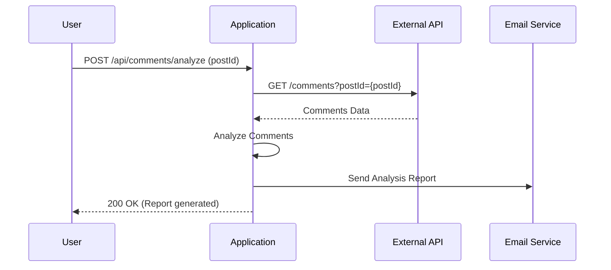
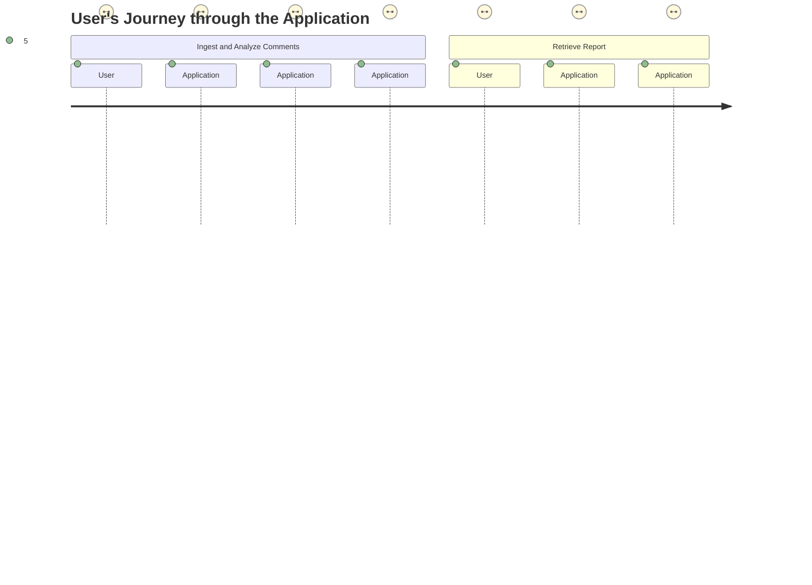

# Final Functional Requirements for Comment Analysis Application

## API Endpoints

### 1. **POST /api/comments/analyze**
- **Purpose**: Retrieve comments data from an external API and perform analysis.
- **Request Format**:
  - **POST Body**: 
    ```json
    {
      "postId": "<integer>"
    }
    ```
- **Response Format**:
  - **200 OK**:
    ```json
    {
      "status": "success",
      "message": "Comments analyzed and report generated."
    }
    ```
  - **400 Bad Request**:
    ```json
    {
      "status": "error",
      "message": "Invalid postId."
    }
    ```

### 2. **GET /api/reports/{reportId}**
- **Purpose**: Retrieve the analysis report by report ID.
- **Response Format**:
  - **200 OK**:
    ```json
    {
      "reportId": "<string>",
      "postId": "<integer>",
      "analysisSummary": "<string>",
      "keywords": ["<string>", "<string>"],
      "sentimentScore": "<double>"
    }
    ```
  - **404 Not Found**:
    ```json
    {
      "status": "error",
      "message": "Report not found."
    }
    ```

## User-App Interaction



