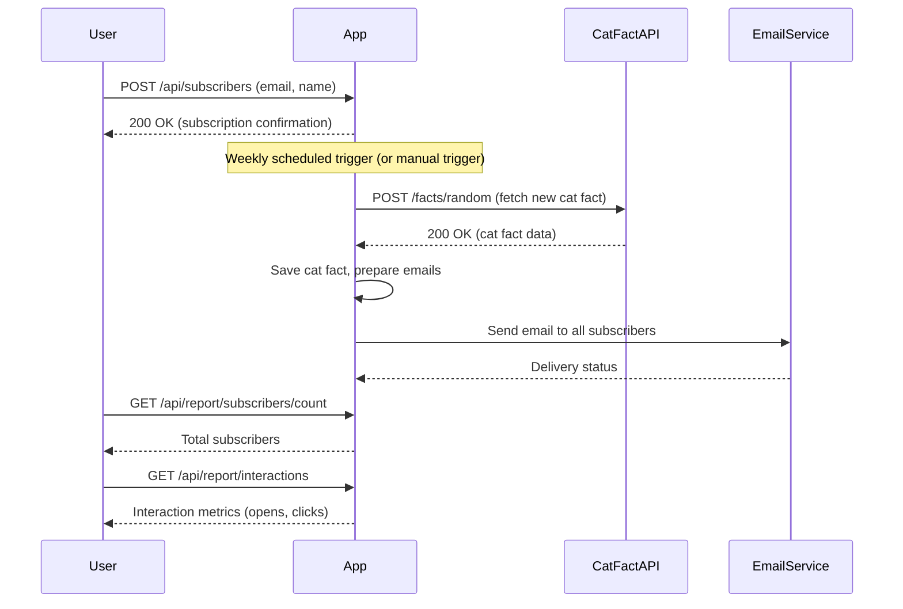

# Functional Requirements and API Design for Weekly Cat Fact Subscription

## API Endpoints

### 1. User Sign-Up  
**POST** `/api/subscribers`  
- **Description:** Register a new subscriber with their email (and optionally name).  
- **Request:**  
```json
{
  "email": "user@example.com",
  "name": "John Doe"   // optional
}
```  
- **Response:**  
```json
{
  "subscriberId": "uuid",
  "message": "Subscription successful"
}
```

### 2. Trigger Weekly Cat Fact Fetch and Email Send-Out  
**POST** `/api/facts/send-weekly`  
- **Description:** Trigger data ingestion from Cat Fact API and send the fact email to all subscribers.  
- **Request:**  
```json
{}
```  
- **Response:**  
```json
{
  "status": "success",
  "sentCount": 123
}
```

### 3. Retrieve Subscriber Count  
**GET** `/api/report/subscribers/count`  
- **Description:** Get the total number of subscribers.  
- **Response:**  
```json
{
  "totalSubscribers": 1234
}
```

### 4. Retrieve Interaction Report  
**GET** `/api/report/interactions`  
- **Description:** Get aggregated interaction data (e.g., email opens/clicks).  
- **Response:**  
```json
{
  "interactions": {
    "emailOpens": 1000,
    "linkClicks": 250
  }
}
```

---

## User-App Interaction Sequence Diagram



---

This design follows RESTful rules:  
- All external data retrieval and business logic are done in POST endpoints.  
- GET endpoints are used for retrieving application state and reports only.